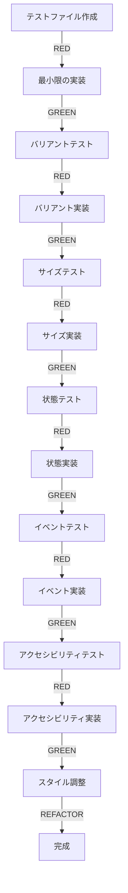

# ボタンコンポーネント実装作業明細書

## 実装方針: TDD（テスト駆動開発）

### 基本サイクル
1. **RED**: 失敗するテストを書く
2. **GREEN**: テストを通す最小限の実装
3. **REFACTOR**: コードを改善

---

## Phase 1: 基本構造の確立（1時間）

### Task 1.1: テストファイル作成と基本レンダリングテスト
```typescript
// button.test.ts
describe('DadsButton - 基本レンダリング', () => {
  it('コンポーネントが存在する', () => {
    // RED: コンポーネントがまだ存在しない
  });
  
  it('Shadow DOMが作成される', () => {
    // RED: Shadow DOMがまだない
  });
  
  it('buttonタグが含まれる', () => {
    // RED: button要素がまだない
  });
});
```

### Task 1.2: 最小限のコンポーネント実装
```typescript
// button.ts
export class DadsButton extends WebComponent {
  static override definition = {
    name: 'dads-button',
    template: html`<button part="base"><slot></slot></button>`,
    styles: css`:host { display: inline-block; }`,
    attributes: []
  };
}
```

### Task 1.3: 登録関数の実装
```typescript
// button-define.ts
export function defineButton() {
  customElements.define('dads-button', DadsButton);
}
```

---

## Phase 2: バリアント実装（1.5時間）

### Task 2.1: バリアントテスト作成
```typescript
describe('DadsButton - バリアント', () => {
  it('デフォルトでsolid variantが適用される', () => {
    // RED
  });
  
  it('outlined variantが適用される', () => {
    // RED
  });
  
  it('text variantが適用される', () => {
    // RED
  });
});
```

### Task 2.2: バリアント属性の実装
- PropertyAttr('variant')を追加
- デフォルト値の設定
- 属性変更の処理

### Task 2.3: バリアントスタイルの実装
- トークンベースのスタイル適用
- :host([variant="xxx"])セレクタ使用
- Figmaデザイン準拠の色設定

---

## Phase 3: サイズ実装（1時間）

### Task 3.1: サイズテスト作成
```typescript
describe('DadsButton - サイズ', () => {
  it('デフォルトでmediumサイズが適用される', () => {
    // RED
  });
  
  it.each(['x-small', 'small', 'medium', 'large'])('%sサイズが適用される', (size) => {
    // RED
  });
});
```

### Task 3.2: サイズ属性の実装
- PropertyAttr('size')を追加
- サイズごとのトークン適用

### Task 3.3: サイズスタイルの実装
- 高さ、パディング、フォントサイズの調整
- レスポンシブ対応

---

## Phase 4: 状態管理（1.5時間）

### Task 4.1: disabled状態テスト
```typescript
describe('DadsButton - 状態', () => {
  it('disabled属性でボタンが無効化される', () => {
    // RED
  });
  
  it('disabled時にクリックイベントが発火しない', () => {
    // RED
  });
});
```

### Task 4.2: disabled実装
- BooleanAttr('disabled')を追加
- イベント抑制の実装
- スタイル調整

### Task 4.3: hover/active状態の実装
- CSSでの状態スタイル
- トランジション効果

---

## Phase 5: イベント処理（1時間）

### Task 5.1: クリックイベントテスト
```typescript
describe('DadsButton - イベント', () => {
  it('クリック時にカスタムイベントが発火する', () => {
    // RED
  });
  
  it('イベントdetailにvariantとsizeが含まれる', () => {
    // RED
  });
});
```

### Task 5.2: イベントハンドラ実装
- クリックハンドラの追加
- カスタムイベントの発火
- イベントバブリング設定

### Task 5.3: キーボードイベント対応
- Enter/Spaceキーでのアクティベーション
- preventDefaultの適切な使用

---

## Phase 6: アクセシビリティ（1.5時間）

### Task 6.1: フォーカステスト
```typescript
describe('DadsButton - アクセシビリティ', () => {
  it('フォーカス時に黄色リングが表示される', () => {
    // RED
  });
  
  it('タブキーでフォーカス可能', () => {
    // RED
  });
});
```

### Task 6.2: フォーカススタイル実装
- デジタル庁準拠のフォーカススタイル
- 黄色背景 + 黒枠の実装
- :focus-visibleの使用

### Task 6.3: ARIA属性の実装
- role属性の適切な設定
- aria-disabledの連動
- aria-pressedのサポート（将来用）

---

## Phase 7: スタイル完成（1時間）

### Task 7.1: Figmaデザイン完全準拠
- 正確な色値の適用
- 正確なスペーシング
- 正確なフォント設定

### Task 7.2: トークン統合
- セマンティックトークンの活用
- ローカルトークンの適用
- カスタマイズ可能性の確保

### Task 7.3: リセットCSS適用
- withReset()の使用
- minimal版の適用

---

## Phase 8: 最終確認とリファクタリング（30分）

### Task 8.1: 全テストの実行
```bash
npm test packages/components/button
```

### Task 8.2: コードカバレッジ確認
```bash
npm run test:coverage
```

### Task 8.3: リファクタリング
- 重複コードの除去
- パフォーマンス最適化
- 型定義の改善

### Task 8.4: Storybook確認
```bash
npm run storybook
# http://localhost:6006でバリアント確認
```

---

## 実装順序サマリー



---

## 成功基準

### 必須要件
- [ ] 全テストが通る（グリーン）
- [ ] コードカバレッジ90%以上
- [ ] TypeScript型エラーなし
- [ ] Storybookで全バリアント表示
- [ ] Figmaデザインとピクセルパーフェクト

### 品質基準
- [ ] パフォーマンス: 初回レンダリング10ms以下
- [ ] アクセシビリティ: WCAG 2.2 AA準拠
- [ ] バンドルサイズ: 5KB以下（gzip後）
- [ ] 保守性: JSDocコメント完備

---

## 所要時間
- **総計**: 約8時間
- **Phase 1-4**: 5時間（基本機能）
- **Phase 5-8**: 3時間（品質向上）

## 注意事項
1. 各テストは必ず**失敗する状態（RED）**から始める
2. テストを通すための**最小限の実装（GREEN）**を心がける
3. 機能が動いたら**リファクタリング**を忘れない
4. コミットは各Phase完了ごとに行う
5. 不明点があれば要件定義書・Design Docを参照