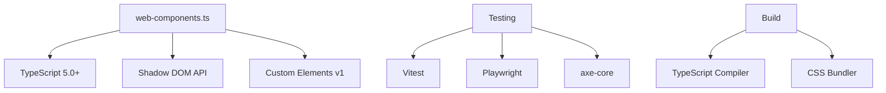
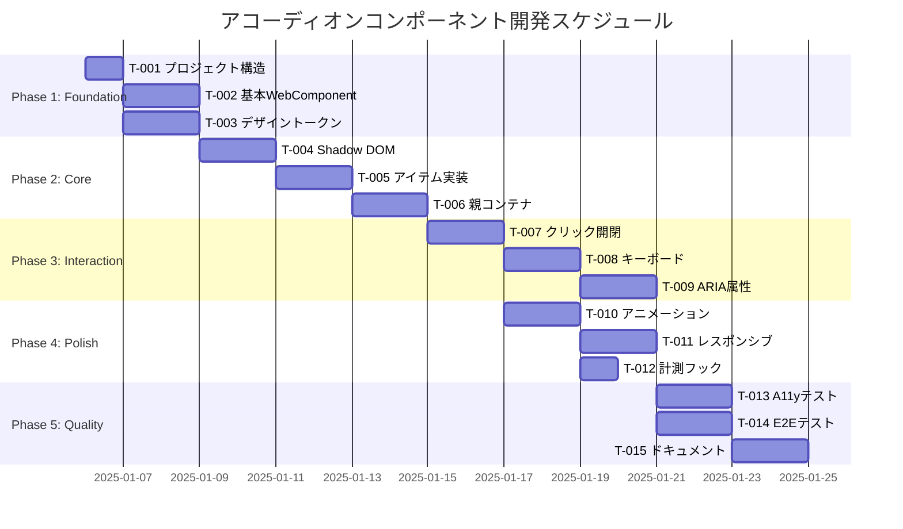

# デジタル庁アコーディオンWeb Component 実行計画書（SOW）

## エグゼクティブサマリー

**プロジェクト名**: デジタル庁デザインシステム アコーディオンWeb Component開発  
**期間**: 2週間（10営業日）  
**チーム規模**: 1-2名（Frontend Engineer + QA Engineer）  
**予算**: 開発工数 26時間  

### 成功基準
- WCAG 2.1 AA完全準拠
- 60fps アニメーション性能
- TypeScript 100%型安全実装
- デザイントークン完全統合
- 自動テストカバレッジ 90%以上

## 1. プロジェクト概要

### 1.1 目的
デジタル庁デザインシステムに準拠したアコーディオンコンポーネントをWeb Components技術で実装し、再利用性・保守性・アクセシビリティを向上させる。

### 1.2 スコープ
**対象範囲**:
- dgov-accordion（親コンテナ）コンポーネント
- dgov-accordion-item（個別アイテム）コンポーネント
- デザイントークン統合
- アクセシビリティ完全対応
- レスポンシブデザイン実装
- パフォーマンス最適化
- 自動テストスイート
- APIドキュメンテーション

**対象外**:
- レガシーブラウザ（IE11）対応
- SSR/SSG対応
- 既存実装との完全互換性

### 1.3 非機能要件

| 項目 | 要件 | 測定方法 |
|------|------|----------|
| パフォーマンス | FCP < 1.8s, FID < 100ms, CLS < 0.1 | Lighthouse CI |
| アクセシビリティ | WCAG 2.1 AA準拠 | axe-core |
| 国際化 | RTL対応、多言語サポート | 手動検証 |
| セキュリティ | XSS防止、CSP対応 | セキュリティレビュー |
| 可観測性 | テレメトリ統合 | カスタムメトリクス |

## 2. フェーズ定義と実行計画

### Phase 1: Foundation（基盤構築）
**期間**: Day 1（4.5時間）  
**目的**: プロジェクト基盤とデザインシステム統合  

#### タスク一覧
| ID | タスク | 工数 | 担当 | 完了条件 |
|----|--------|------|------|----------|
| T-001 | プロジェクト構造準備とTypeScript設定 | 1h | Frontend | tsc --noEmit成功 |
| T-002 | 基本WebComponentクラス実装 | 2h | Frontend | customElements登録成功 |
| T-003 | デザイントークンCSS変数定義 | 1.5h | Frontend | コントラスト検証合格 |

#### 成果物
- src/accordion/ディレクトリ構造
- TypeScript設定ファイル
- WebComponentベースクラス
- デザイントークン定義ファイル

#### 受け入れ基準
- [ ] TypeScript strict modeでエラーなし
- [ ] WebComponentが正常に登録される
- [ ] デザイントークンが正しく適用される
- [ ] ビルドプロセスが正常動作

#### E2E手順
```bash
# 1. プロジェクト構造確認
ls -la src/accordion/

# 2. TypeScript検証
tsc --noEmit web-components.ts --strict

# 3. コンポーネント登録確認
node -e "import './src/accordion/dgov-accordion.js'; console.log(customElements.get('dgov-accordion'))"

# 4. トークン適用確認
open tests/visual/tokens.html
```

---

### Phase 2: Core Implementation（コア実装）
**期間**: Day 2-3（6時間）  
**目的**: コアコンポーネント機能の実装  

#### タスク一覧
| ID | タスク | 工数 | 担当 | 完了条件 |
|----|--------|------|------|----------|
| T-004 | Shadow DOMテンプレート構造 | 2h | Frontend | Slot配置完了 |
| T-005 | アコーディオンアイテム基本実装 | 2h | Frontend | expanded属性動作 |
| T-006 | 親コンテナーロジック実装 | 2h | Frontend | 状態同期確認 |

#### 成果物
- Shadow DOM構造定義
- DgovAccordionItemクラス
- 親子間通信メカニズム
- 状態管理ロジック

#### 受け入れ基準
- [ ] Shadow DOMが正しくレンダリングされる
- [ ] Slotによるコンテンツ配置が機能する
- [ ] 親子コンポーネント間の通信が確立される
- [ ] allow-multiple属性が正しく動作する

#### E2E手順
```bash
# 1. Shadow DOM構造確認
open tests/integration/shadow-dom.html
# DevToolsでShadow DOM内部を検査

# 2. 親子通信テスト
npm run test:integration -- --grep "parent-child communication"

# 3. 状態管理確認
open tests/manual/state-management.html
# 複数アイテムの開閉動作を確認
```

---

### Phase 3: Interaction & Accessibility（インタラクションとアクセシビリティ）
**期間**: Day 4-5（5時間）  
**目的**: ユーザーインタラクションとアクセシビリティ実装  

#### タスク一覧
| ID | タスク | 工数 | 担当 | 完了条件 |
|----|--------|------|------|----------|
| T-007 | クリック開閉インタラクション | 1.5h | Frontend | クリック/タッチ動作 |
| T-008 | キーボードナビゲーション実装 | 2h | Frontend | 全キー操作対応 |
| T-009 | ARIA属性動的更新 | 1.5h | Frontend | スクリーンリーダー対応 |

#### 成果物
- イベントハンドラー実装
- キーボードナビゲーション機能
- ARIA属性管理システム
- フォーカス管理ロジック

#### 受け入れ基準
- [ ] クリック/タッチで開閉動作
- [ ] Enter/Space/矢印キーが正しく機能
- [ ] aria-expanded/aria-controlsが動的更新
- [ ] スクリーンリーダーで正しく読み上げ

#### E2E手順
```bash
# 1. インタラクションテスト
npm run test:e2e -- --spec interaction.spec.ts

# 2. キーボードナビゲーション確認
open tests/manual/keyboard-nav.html
# Tab, Enter, Space, Arrow, Home, Endキーをテスト

# 3. アクセシビリティ検証
npm run test:a11y

# 4. スクリーンリーダーテスト（手動）
# NVDA/JAWS/VoiceOverで動作確認
```

---

### Phase 4: Polish & Performance（仕上げと最適化）
**期間**: Day 6-7（4.5時間）  
**目的**: アニメーションとパフォーマンス最適化  

#### タスク一覧
| ID | タスク | 工数 | 担当 | 完了条件 |
|----|--------|------|------|----------|
| T-010 | CSSアニメーション実装 | 2h | Frontend | 60fps維持 |
| T-011 | レスポンシブブレークポイント | 1.5h | Frontend | 3デバイス対応 |
| T-012 | パフォーマンス計測フック | 1h | Frontend | メトリクス収集 |

#### 成果物
- スムーズなアニメーション実装
- レスポンシブスタイルシート
- パフォーマンス計測システム
- reduced-motion対応

#### 受け入れ基準
- [ ] アニメーションが60fpsで動作
- [ ] モバイル/タブレット/デスクトップ対応
- [ ] パフォーマンスメトリクス収集可能
- [ ] prefers-reduced-motion尊重

#### E2E手順
```bash
# 1. アニメーション性能測定
npm run perf:animation

# 2. レスポンシブ確認
npm run test:responsive

# 3. パフォーマンス計測
npm run perf:metrics
# Chrome DevTools Performance タブで検証

# 4. Lighthouse実行
npm run lighthouse -- --only-categories=performance
```

---

### Phase 5: Quality & Documentation（品質保証とドキュメンテーション）
**期間**: Day 8-10（5.5時間）  
**目的**: テスト自動化とドキュメント作成  

#### タスク一覧
| ID | タスク | 工数 | 担当 | 完了条件 |
|----|--------|------|------|----------|
| T-013 | アクセシビリティテスト自動化 | 2h | QA | axe-core統合 |
| T-014 | E2Eテストシナリオ実装 | 2h | QA | 全シナリオ合格 |
| T-015 | APIドキュメント・使用例作成 | 1.5h | Frontend | ドキュメント公開 |

#### 成果物
- 自動テストスイート
- E2Eテストシナリオ
- APIリファレンス
- 使用例とデモサイト

#### 受け入れ基準
- [ ] WCAG 2.2 AA全項目合格
- [ ] E2Eテスト合格率100%
- [ ] APIドキュメント完成
- [ ] デモサイト公開

#### E2E手順
```bash
# 1. 全テスト実行
npm run test:all

# 2. カバレッジレポート確認
npm run coverage

# 3. ドキュメントビルド
npm run docs:build

# 4. デモサイト確認
npm run demo:serve
open http://localhost:8080
```

## 3. 依存関係と前提条件

### 技術的依存関係


### 前提条件
1. **開発環境**
   - Node.js 18.0+
   - TypeScript 5.0+
   - 最新版Chrome/Firefox/Safari

2. **ライブラリ**
   - web-components.tsライブラリ利用可能
   - デザイントークン定義ファイル提供

3. **アクセス権限**
   - GitHubリポジトリへの書き込み権限
   - npm レジストリへの公開権限
   - デモサイトホスティング環境

## 4. リスク管理

### リスクマトリクス

| リスク | 影響度 | 発生確率 | 対策 | オーナー |
|--------|--------|----------|------|----------|
| アクセシビリティ要件未達 | 高 | 中 | 早期テスト、専門家レビュー | QA |
| パフォーマンス目標未達 | 中 | 低 | 継続的計測、最適化 | Frontend |
| Shadow DOM互換性問題 | 中 | 低 | Polyfill準備、代替実装 | Frontend |
| スケジュール遅延 | 中 | 中 | バッファ時間確保、優先順位付け | PM |
| デザイントークン変更 | 低 | 中 | 変更通知プロセス、自動同期 | Design |

### ロールバック計画

#### Phase 1-2 ロールバック
```bash
# 完全削除による初期状態復帰
git revert --no-commit HEAD~n
rm -rf src/accordion/
git commit -m "rollback: Phase 1-2 implementation"
```

#### Phase 3-4 ロールバック
```bash
# Feature flagによる機能無効化
export ACCORDION_FEATURES="interaction:false,animation:false"
npm run build -- --features minimal
```

#### Phase 5 ロールバック
```bash
# テストとドキュメントの一時除外
npm run build -- --skip-tests --skip-docs
# 以前のバージョンのドキュメントを復元
git checkout v1.0.0 -- docs/
```

## 5. 品質ゲート

### 各フェーズの品質基準

| フェーズ | メトリクス | 基準値 | 測定方法 |
|----------|------------|--------|----------|
| Phase 1 | TypeScriptエラー | 0 | tsc --noEmit |
| Phase 2 | Shadow DOMレンダリング | 100%成功 | 統合テスト |
| Phase 3 | WCAG違反 | 0 | axe-core |
| Phase 4 | アニメーションFPS | ≥60 | Performance API |
| Phase 5 | テストカバレッジ | ≥90% | c8/nyc |

### レビュープロセス

1. **コードレビュー**
   - 各タスク完了時にPull Request作成
   - 最低1名のレビュアー承認必須
   - CI/CDパイプライン全項目合格

2. **デザインレビュー**
   - Phase 2, 4完了時に実施
   - デザイナー承認必須
   - ビジュアル回帰テスト合格

3. **アクセシビリティレビュー**
   - Phase 3, 5完了時に実施
   - A11y専門家の確認
   - 実機テスト（スクリーンリーダー）

## 6. リソース配分と役割

### チーム構成

| 役割 | 責任範囲 | 必要スキル | 工数配分 |
|------|----------|------------|----------|
| Frontend Engineer | 実装全般、ドキュメント | TypeScript, Web Components | 20.5h (79%) |
| QA Engineer | テスト設計・実装 | Playwright, axe-core | 4h (15%) |
| Design Review | デザイン確認 | デザインシステム知識 | 1.5h (6%) |

### RACI マトリクス

| タスク | Frontend | QA | Design | PM |
|--------|----------|-----|--------|-----|
| 実装 | R/A | C | I | I |
| テスト | C | R/A | I | I |
| ドキュメント | R/A | C | C | I |
| レビュー | R | R | C/A | I |
| リリース | C | C | I | R/A |

*R=Responsible, A=Accountable, C=Consulted, I=Informed*

## 7. 進捗測定方法

### KPIダッシュボード

```yaml
metrics:
  velocity:
    - tasks_completed_per_day
    - story_points_delivered
  quality:
    - defect_density
    - test_coverage_percentage
    - wcag_violations_count
  performance:
    - fps_average
    - render_time_p95
    - interaction_delay_p95
```

### 日次スタンドアップ項目
1. 昨日の完了タスク
2. 今日の予定タスク
3. ブロッカーの有無
4. リスクの更新

### 週次レポート内容
- 完了タスク一覧
- 残タスク・進捗率
- 品質メトリクス
- リスク状況
- 次週の計画

## 8. コミュニケーション計画

### 定例会議

| 会議 | 頻度 | 参加者 | 目的 |
|------|------|--------|------|
| デイリースタンドアップ | 毎日 15分 | 開発チーム | 進捗共有・ブロッカー解決 |
| フェーズレビュー | フェーズ完了時 | 全ステークホルダー | 成果物確認・承認 |
| レトロスペクティブ | 週次 30分 | 開発チーム | 改善点の識別 |

### エスカレーションパス
1. **技術的問題**: Frontend Lead → Tech Lead → CTO
2. **デザイン問題**: Frontend → Design Lead → Head of Design
3. **スケジュール問題**: PM → Project Director
4. **品質問題**: QA Lead → Quality Manager

## 9. ガントチャート



## 10. 成功基準チェックリスト

### 技術的成功基準
- [ ] 全15タスクの完了
- [ ] TypeScript 100%型安全
- [ ] Shadow DOM完全カプセル化
- [ ] デザイントークン100%使用

### 品質成功基準
- [ ] WCAG 2.2 AA完全準拠
- [ ] テストカバレッジ90%以上
- [ ] 0クリティカルバグ
- [ ] パフォーマンス目標達成

### プロジェクト成功基準
- [ ] 予定期間内完了
- [ ] 予算内完了
- [ ] ステークホルダー承認獲得
- [ ] 本番環境デプロイ完了

## 11. 付録

### A. 参照ドキュメント
- [設計書](./design-doc-accordion-component.md)
- [タスク分解書](./tasks/accordion-component-tasks.md)
- [デジタル庁デザインシステム](https://design.digital.go.jp/)
- [WAI-ARIA Authoring Practices](https://www.w3.org/WAI/ARIA/apg/patterns/accordion/)

### B. ツール・環境
- **開発**: VS Code, TypeScript, web-components.ts
- **テスト**: Vitest, Playwright, axe-core
- **CI/CD**: GitHub Actions, Lighthouse CI
- **監視**: Performance Observer API, Custom Telemetry

### C. 連絡先
- **プロジェクトマネージャー**: pm@example.com
- **テクニカルリード**: tech-lead@example.com
- **デザインリード**: design-lead@example.com
- **QAリード**: qa-lead@example.com

---

**文書バージョン**: 1.0.0  
**作成日**: 2025-08-28  
**作成者**: Work-Orchestrator (Claude Code)  
**承認者**: (未定)  
**ステータス**: レビュー待ち