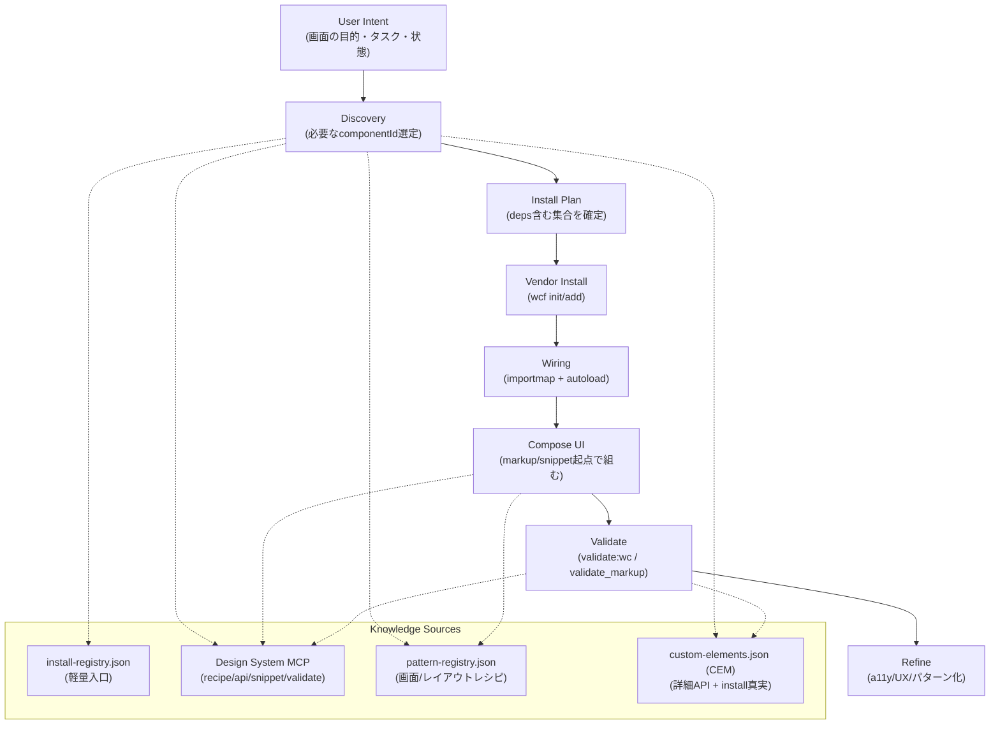

# Skill Map：vendor install + AI理解で UI を組む

目的：この「スキル図（Skill Map）」を AI / コーディングエージェントが読み込めば、対話しながら
1) 必要な Web Components を選定し、2) vendor に install し、3) UI（画面/レイアウト）を組み、4) 検証できる状態にする。

## 3つのレイヤ（スケールのための分離）

1. **Source of Truth（詳細）**: `custom-elements.json`（CEM）
2. **Fast Entry（軽量）**: `registry/install-registry.json`（deps/define/call/source/tags）
3. **Actions（作業）**: `wcf` CLI / Design System MCP / validator

> CEM は容量が大きいので、AI/CLI の入口は軽量レジストリを基本にし、詳細が必要な時だけ CEM を参照する。

## Skill Graph（スキル図）

## 各スキル（入出力を決め切る）

### 1) Discovery（コンポーネント選定）

- **入力**: 画面要件（フォーム/一覧/ナビ/通知など）
- **参照**: `registry/install-registry.json`（まずこれ）
- **出力**: `componentIds[]`（deps込み）、prefix（例：`myui`）
- **補助**（必要時のみ）: CEM/MCP で属性/slot/event/cssPart を確認

### 2) Vendor Install（持ち込み）

- **入力**: `componentIds[]`, `prefix`, `outDir`, `lang(js|ts)`
- **操作**: `wcf init` → `wcf add <componentIds...>`
- **出力**: `vendor/components/<prefix>/`（autoload/importmap等）
- **運用**: 手編集するものは `detach`、更新に戻すなら `attach`

### 3) Wiring（配線）

- **入力**: `importmap.snippet.json` と autoload entry
- **出力**: `index.html`（またはアプリ内の importmap統合）
- **注意**: `--lang js` は “ブラウザ直実行しやすい ESM” を前提

### 4) Compose UI（UI組み立て）

- **入力**: usage snippet（MCP `generate_usage_snippet` など）
- **出力**: 最小の画面（状態/バリエーション含む）
- **最優先**: まず “動く最小” を通し、後段で磨く

### 5) Validate（壊れてないか）

- **入力**: HTML断片 or `viewer.html` / `src/demos.ts`
- **操作**: `npm run validate:wc` もしくは MCP `validate_markup`
- **出力**: unknownElement/error を 0 にする（unknownAttribute は warning 扱い）

### 6) Refine（パターン化してスケールさせる）

- **入力**: 動いた画面 + 学び
- **出力**: `registry/pattern-registry.json` に “レシピ” として追加する（AIが再利用できる形）
- **取得**: MCP `list_patterns` / `get_pattern_recipe` / `generate_pattern_snippet`
- **チェック**: `npm run patterns:check`（CIで強制）

## 将来の新規コンポーネントに自動適用される理由

- CEM 生成時に `decl.custom.install` が注入される（install metadata）
- `registry/install-registry.json` は CEM から生成され、CIで同期が強制される
- contracts/CI が「autoload と install metadata を全タグで必須」にしている

関連：
- `docs/knowledge/ai-consumption.md`
- `docs/knowledge/wcf-cli.md`
- `docs/rules/installable-component-contract.md`
- `docs/rules/ui-pattern-contract.md`
