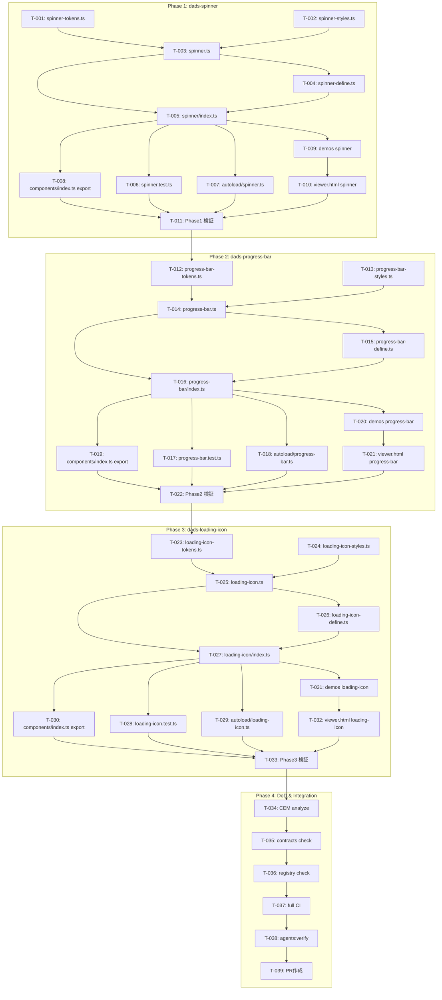

# Progress Indicator - Atomic Task Cards

**作成日**: 2026-02-23
**設計ドキュメント**: `docs/plans/progress-indicator-design.md`
**ブランチ**: `worktree-feat_progress_indicator_component`

---

## 概要

設計ドキュメントを実行可能な原子的タスクに分解する。各タスクは「1ファイル = 1コミット = 1意図」の原則に従い、TDD前提でテストを先行配置する。

### 分解原則

| 原則 | 適用方法 |
|------|----------|
| Vertical Slicing | 各Phaseが1コンポーネントの完全なスライス |
| 1 task = 1 file | 1つのファイル作成 or 更新のみ |
| TDD First | テストファイル作成を実装より先に配置（依存の範囲で） |
| Reversibility | 各タスクは `git revert` で安全に取り消し可能 |
| <200 lines | 各タスクのdiffは200行以内を目標 |

---

## DAG Overview (Mermaid)



---

## Phase 1: dads-spinner (Indeterminate回転アニメーション)

### T-001: spinner-tokens.ts 作成

| 項目 | 内容 |
|------|------|
| **ID** | T-001 |
| **Phase** | P1 |
| **タイプ** | feature |
| **タイトル** | Spinner用デザイントークン定義ファイルを作成する |
| **blockedBy** | なし |
| **入力ファイル** | `packages/components/icon/icon-tokens.ts` (参照パターン), `packages/components/divider/divider-tokens.ts` (参照パターン) |
| **出力ファイル** | `packages/components/spinner/spinner-tokens.ts` |
| **参照コードパターン** | divider-tokens.ts の semantic→local 2層構造、文字列→css変換パターン |
| **見積もり** | 30min |

**受入基準**:
- [ ] `spinnerSemanticTokensText` に5トークン定義 (track-color, indicator-color, label-color, underlay-bg, underlay-border)
- [ ] semantic source: `var(--color-primitive-blue-100, #d9e6ff)` 等にフォールバック付き
- [ ] `spinnerLocalTokensText` に `--dads-spinner-*` → `var(--spinner-*)` マッピング
- [ ] `export const spinnerTokens = css\`...\``
- [ ] ハードコードされたカラー値が含まれないこと (`#` で始まる値はフォールバックのみ)
- [ ] TypeScript型チェック通過: `npm run type-check`

**テスト観点**:
- T-006(spinner.test.ts) で間接検証: Shadow DOM内のcomputed styleにトークンが適用されていること (happy-domではCSSカスタムプロパティの完全な検証は困難なため、構造テストで代替)

---

### T-002: spinner-styles.ts 作成

| 項目 | 内容 |
|------|------|
| **ID** | T-002 |
| **Phase** | P1 |
| **タイプ** | feature |
| **タイトル** | Spinnerスタイルシート (アニメーション・レイアウト・a11y) を作成する |
| **blockedBy** | なし |
| **入力ファイル** | `packages/components/icon/icon-styles.ts` (参照パターン), `packages/components/divider/divider-styles.ts` (forced-colorsパターン) |
| **出力ファイル** | `packages/components/spinner/spinner-styles.ts` |
| **参照コードパターン** | divider-styles.ts の forced-colors/CanvasText パターン, `::part()` セレクタ |
| **見積もり** | 45min |

**受入基準**:
- [ ] `:host` に `display: inline-flex`, `contain: layout paint style`
- [ ] `[part="svg"]` に `@keyframes spinner-rotate` (2s linear infinite)
- [ ] `[part="indicator"]` に `@keyframes spinner-dash` (1.4s ease-in-out infinite), `stroke-dasharray: 125.66`
- [ ] `:host([size="sm"])` で 24px, デフォルト(lg) で 48px
- [ ] `:host([composition="stacked"])` で flex-column + gap: `var(--spacing-4)`
- [ ] `:host([composition="inlined"])` で inline-flex + gap: `var(--spacing-2)` + `min-width: 0`
- [ ] `[part="underlay"]` で min 128x128, border-radius 12px, 1px solid border
- [ ] `@media (prefers-reduced-motion: reduce)` で `animation: none`, `stroke-dashoffset: 60`
- [ ] `@media (forced-colors: active)` で track=CanvasText, indicator=Highlight, underlay border=CanvasText
- [ ] `[part="label"]` に typography トークン (font-size-16, weight-400, line-height 1.7)
- [ ] `!important` 不使用
- [ ] クラスセレクタ不使用 (全て `[part="..."]` または `:host(...)`)
- [ ] ネスト1階層以内 (`@layer`, 疑似クラス, メディアクエリ除く)

**テスト観点**:
- CSS構造はhappy-domでの検証が困難なため、part要素の存在をT-006で検証
- アニメーション動作はE2E(Playwright)で将来検証

---

### T-003: spinner.ts 作成

| 項目 | 内容 |
|------|------|
| **ID** | T-003 |
| **Phase** | P1 |
| **タイプ** | feature |
| **タイトル** | DadsSpinner コンポーネントクラスを作成する |
| **blockedBy** | T-001, T-002 |
| **入力ファイル** | `packages/components/icon/icon.ts` (参照パターン: label/aria-hidden), `packages/core/typography/typography-web-component.ts`, `packages/styles/reset-css.ts` |
| **出力ファイル** | `packages/components/spinner/spinner.ts` |
| **参照コードパターン** | icon.ts の label → aria-hidden/role="img" 切替パターン, TypographyWebComponent extends, withReset, setDefaultAttributes |
| **見積もり** | 60min |

**受入基準**:
- [ ] `extends TypographyWebComponent`
- [ ] JSDoc: `@customElement`, `@tagname dads-spinner`
- [ ] JSDoc: `@attr {'sm' | 'lg'} size`, `@attr {'stacked' | 'inlined'} composition`, `@attr {boolean} underlay`, `@attr {string} label`
- [ ] JSDoc: `@csspart base`, `@csspart svg`, `@csspart track`, `@csspart indicator`, `@csspart label`, `@csspart underlay`
- [ ] JSDoc: `@cssprop` 5つ (track-color, indicator-color, label-color, underlay-bg, underlay-border)
- [ ] template: SVG `viewBox="0 0 48 48"`, circle(track) r=20 stroke-width=4, circle(indicator) r=20 stroke-dasharray=125.66
- [ ] `styles: withReset([applyDADSTokens(), applySpacingTokens(), spinnerTokens, spinnerStyles], 'minimal')`
- [ ] attributes: `PropertyAttr('size')`, `PropertyAttr('composition')`, `BooleanAttr('underlay')`, `PropertyAttr('label')`
- [ ] `connectedCallback()` で `setDefaultAttributes({ size: 'lg', composition: 'stacked' })`
- [ ] `role="progressbar"` を template の `[part="base"]` に設定
- [ ] `labelChanged()` で: label有り → `aria-label` 設定 + `[part="label"]` 表示、label無し → `aria-label` 削除
- [ ] indeterminate: `aria-valuenow`, `aria-valuemin`, `aria-valuemax` **すべて省略**
- [ ] `#privateField` パターン使用
- [ ] `any` 型不使用, `Array.forEach` 不使用
- [ ] TypeScript strict mode通過

**テスト観点**:
- T-006で全assertを検証

---

### T-004: spinner-define.ts 作成

| 項目 | 内容 |
|------|------|
| **ID** | T-004 |
| **Phase** | P1 |
| **タイプ** | feature |
| **タイトル** | Spinner define関数を作成する |
| **blockedBy** | T-003 |
| **入力ファイル** | `packages/components/icon/icon-define.ts` (参照パターン) |
| **出力ファイル** | `packages/components/spinner/spinner-define.ts` |
| **参照コードパターン** | icon-define.ts の defineIcon/defineDefaultIcon/autoDefineIcon パターン |
| **見積もり** | 15min |

**受入基準**:
- [ ] `export function defineSpinner(prefix?, registry?)` - WebComponentDefinition.compose + define
- [ ] `export function defineDefaultSpinner()` - defineSpinner() 呼び出し
- [ ] `export function autoDefineSpinner()` - typeof customElements チェック
- [ ] 重複登録ガード: `effectiveRegistry.get(name)` で既存チェック
- [ ] getPrefix/getConfig を使用

**テスト観点**:
- T-006で「重複実行しても問題なく登録される」を検証

---

### T-005: spinner/index.ts 作成

| 項目 | 内容 |
|------|------|
| **ID** | T-005 |
| **Phase** | P1 |
| **タイプ** | feature |
| **タイトル** | Spinner パッケージ index (re-export) を作成する |
| **blockedBy** | T-003, T-004 |
| **入力ファイル** | `packages/components/icon/index.ts` (参照パターン) |
| **出力ファイル** | `packages/components/spinner/index.ts` |
| **参照コードパターン** | icon/index.ts の4行export構成 |
| **見積もり** | 5min |

**受入基準**:
- [ ] `export { DadsSpinner } from './spinner.js'`
- [ ] `export { defineSpinner, defineDefaultSpinner } from './spinner-define.js'`
- [ ] `export { spinnerStyles } from './spinner-styles.js'`
- [ ] `export { spinnerTokens } from './spinner-tokens.js'`
- [ ] `.js` 拡張子使用

**テスト観点**:
- import解決はT-006およびT-011の型チェックで検証

---

### T-006: spinner.test.ts 作成

| 項目 | 内容 |
|------|------|
| **ID** | T-006 |
| **Phase** | P1 |
| **タイプ** | feature |
| **タイトル** | Spinner テストファイルを作成する (TDD) |
| **blockedBy** | T-005 |
| **入力ファイル** | `packages/components/icon/icon.test.ts` (参照パターン), `tests/setup.ts` |
| **出力ファイル** | `packages/components/spinner/spinner.test.ts` |
| **参照コードパターン** | icon.test.ts の describe/it構成, dynamic import, createTestElement, waitForCustomElement, cleanupTestElement |
| **見積もり** | 60min |

**受入基準 (テストケース一覧)**:

**describe('DadsSpinner - 基本')**:
- [ ] `it('defineSpinner() 重複実行で問題なく登録')` - defineSpinner()x2, customElements.get('dads-spinner') truthy
- [ ] `it('Shadow DOM内にSVG要素が存在')` - svg part="svg" 存在確認
- [ ] `it('SVGにcircle(track)とcircle(indicator)が存在')` - 2つのcircle要素, r=20, stroke-width=4
- [ ] `it('[part="base"]にrole="progressbar"が設定')` - getAttribute('role') === 'progressbar'

**describe('DadsSpinner - サイズ')**:
- [ ] `it('デフォルトsize="lg"')` - connectedCallback後にsize属性が'lg'
- [ ] `it('size="sm"が反映される')` - setAttribute('size', 'sm'), getAttribute確認

**describe('DadsSpinner - レイアウト')**:
- [ ] `it('デフォルトcomposition="stacked"')` - connectedCallback後にcomposition属性が'stacked'
- [ ] `it('composition="inlined"が反映')` - setAttribute確認
- [ ] `it('underlay属性でunderlay partが表示')` - underlay part存在確認

**describe('DadsSpinner - ARIA/アクセシビリティ')**:
- [ ] `it('indeterminate: aria-valuenow/min/maxが存在しない')` - 3属性すべてnull
- [ ] `it('label指定時にaria-labelが設定される')` - setAttribute('label', '読み込み中'), aria-label確認
- [ ] `it('label未指定時にaria-labelがない')` - aria-label === null
- [ ] `it('label指定時にlabel partが存在')` - [part="label"] 存在確認
- [ ] `it('label削除でaria-labelも削除')` - removeAttribute後にaria-label === null

**describe('DadsSpinner - CSS Parts')**:
- [ ] `it('全6パーツが存在する')` - base, svg, track, indicator, label, underlay の各part属性存在確認

**検証コマンド**: `npm test -- packages/components/spinner/spinner.test.ts`

---

### T-007: autoload/dads/spinner.ts 作成

| 項目 | 内容 |
|------|------|
| **ID** | T-007 |
| **Phase** | P1 |
| **タイプ** | feature |
| **タイトル** | Spinner autoload アダプタを作成する |
| **blockedBy** | T-005 |
| **入力ファイル** | `packages/autoload/dads/icon.ts` (参照パターン) |
| **出力ファイル** | `packages/autoload/dads/spinner.ts` |
| **参照コードパターン** | icon autoload: import + defineDefault + export default |
| **見積もり** | 5min |

**受入基準**:
- [ ] `import { DadsSpinner, defineDefaultSpinner } from '../../components/spinner/index.js'`
- [ ] `defineDefaultSpinner()` 呼び出し
- [ ] `export default DadsSpinner`
- [ ] `.js` 拡張子使用

**テスト観点**:
- T-011のcontracts:checkで間接検証

---

### T-008: components/index.ts に Spinner export追加

| 項目 | 内容 |
|------|------|
| **ID** | T-008 |
| **Phase** | P1 |
| **タイプ** | feature |
| **タイトル** | packages/components/index.ts にスピナーのexportを追加する |
| **blockedBy** | T-005 |
| **入力ファイル** | `packages/components/index.ts` |
| **出力ファイル** | `packages/components/index.ts` (更新) |
| **参照コードパターン** | 既存の `export * from './icon/index.js'` パターン |
| **見積もり** | 5min |

**受入基準**:
- [ ] `// スピナー` コメント + `export * from './spinner/index.js'` 追加
- [ ] アルファベット順の適切な位置に挿入
- [ ] 型チェック通過

**テスト観点**:
- T-011のtype-checkで間接検証

---

### T-009: demos にSpinnerデモ追加

| 項目 | 内容 |
|------|------|
| **ID** | T-009 |
| **Phase** | P1 |
| **タイプ** | feature |
| **タイトル** | src/demos にSpinnerデモ関数を追加する |
| **blockedBy** | T-005 |
| **入力ファイル** | `src/demos.ts`, `src/demos/extra.ts` (参照パターン), `docs/knowledge/viewer-api-controls-table.md` |
| **出力ファイル** | `src/demos/progress-indicator.ts` (新規), `src/demos.ts` (更新) |
| **参照コードパターン** | extra.ts のデモ関数パターン, viewer-api-controls-table.md のAPI/Controlsテーブルパターン |
| **見積もり** | 45min |

**受入基準**:
- [ ] `src/demos/progress-indicator.ts` に `spinner` デモ関数を作成
- [ ] デモ内容: 全バリアント表示 (stacked/inlined, sm/lg, underlay有無, label有無)
- [ ] Usage `<dads-code-block data-api-code>` 含む
- [ ] API/Controlsテーブル: size (select: sm/lg), composition (select: stacked/inlined), underlay (switch), label (input-text)
- [ ] `data-api-target`, `data-api-attr`, `data-api-reset`, `data-default` 設定
- [ ] 初期化スクリプト: `bindApiControls(root)` パターン
- [ ] `src/demos.ts` に import と spread 追加
- [ ] 先頭 `/` の絶対パスを使わない (相対パス `./` 使用)
- [ ] `placeholder` 属性不使用

**テスト観点**:
- viewer.htmlでの目視確認 (T-010後)
- T-011の型チェックで間接検証

---

### T-010: viewer.html にSpinnerセレクタ追加

| 項目 | 内容 |
|------|------|
| **ID** | T-010 |
| **Phase** | P1 |
| **タイプ** | feature |
| **タイトル** | viewer.html にスピナーのセレクタオプションを追加する |
| **blockedBy** | T-009 |
| **入力ファイル** | `viewer.html` |
| **出力ファイル** | `viewer.html` (更新) |
| **参照コードパターン** | 既存の `<option value="divider">ディバイダー</option>` パターン |
| **見積もり** | 5min |

**受入基準**:
- [ ] `<option value="spinner">スピナー</option>` をセレクタに追加
- [ ] 適切なカテゴリ位置に挿入

**テスト観点**:
- `bun server.ts` → `http://localhost:3000/?component=spinner` で表示確認

---

### T-011: Phase 1 検証コマンド実行

| 項目 | 内容 |
|------|------|
| **ID** | T-011 |
| **Phase** | P1 |
| **タイプ** | observability |
| **タイトル** | Phase 1 の品質ゲートを実行し全パスを確認する |
| **blockedBy** | T-006, T-007, T-008, T-010 |
| **入力ファイル** | Phase 1 全出力ファイル |
| **出力ファイル** | なし (検証のみ) |
| **見積もり** | 15min |

**受入基準 (全コマンドがexit 0)**:
- [ ] `npm run type-check` -- 型チェック通過
- [ ] `npm test -- packages/components/spinner/spinner.test.ts` -- 全テスト通過
- [ ] `npm run lint` -- リントエラーなし
- [ ] `npm run build` -- ビルド通過

**検証コマンド**:
```bash
npm run type-check && \
npm test -- packages/components/spinner/spinner.test.ts && \
npm run lint && \
npm run build
```

---

## Phase 2: dads-progress-bar (Determinate + Indeterminate)

### T-012: progress-bar-tokens.ts 作成

| 項目 | 内容 |
|------|------|
| **ID** | T-012 |
| **Phase** | P2 |
| **タイプ** | feature |
| **タイトル** | Progress Bar 用デザイントークン定義ファイルを作成する |
| **blockedBy** | T-011 |
| **入力ファイル** | `packages/components/spinner/spinner-tokens.ts` (Phase1で作成) |
| **出力ファイル** | `packages/components/progress-bar/progress-bar-tokens.ts` |
| **参照コードパターン** | spinner-tokens.ts と同一の semantic→local 2層構造 |
| **見積もり** | 25min |

**受入基準**:
- [ ] `progressBarSemanticTokensText` に5トークン定義 (spinner共通トークンと同じ色体系)
- [ ] `progressBarLocalTokensText` に `--dads-progress-bar-*` マッピング
- [ ] `export const progressBarTokens = css\`...\``
- [ ] フォールバック値付き
- [ ] 型チェック通過

**テスト観点**:
- T-017で間接検証

---

### T-013: progress-bar-styles.ts 作成

| 項目 | 内容 |
|------|------|
| **ID** | T-013 |
| **Phase** | P2 |
| **タイプ** | feature |
| **タイトル** | Progress Bar スタイルシート (determinate scaleX + indeterminate animation) を作成する |
| **blockedBy** | T-011 |
| **入力ファイル** | `packages/components/spinner/spinner-styles.ts` (参照パターン) |
| **出力ファイル** | `packages/components/progress-bar/progress-bar-styles.ts` |
| **参照コードパターン** | spinner-styles.ts の reduced-motion/forced-colors パターン |
| **見積もり** | 50min |

**受入基準**:
- [ ] `:host` に `display: block`, `contain: layout paint style`
- [ ] `[part="track"]` に height: 4px, background-color, position: relative, overflow: hidden
- [ ] `[part="indicator"]` に position: absolute, inset: 0, transform-origin: left, `will-change: transform`
- [ ] Determinate: `transform: scaleX(var(--progress, 0))`
- [ ] Indeterminate (`:host(:not([value]))` or 判別方法): `@keyframes linear-indeterminate` (translateX/scaleX)
- [ ] Stacked/Inlined レイアウト (spinnerと共通パターン)
- [ ] Underlay パターン (spinnerと共通パターン)
- [ ] Label typography (spinnerと共通パターン)
- [ ] `@media (prefers-reduced-motion: reduce)`: `animation: none`, `transform: translateX(0) scaleX(0.6)`
- [ ] `@media (forced-colors: active)`: track=CanvasText (background-color), indicator=Highlight (background-color)
- [ ] `!important` 不使用, クラスセレクタ不使用

**テスト観点**:
- CSS構造はhappy-domでの完全検証困難、T-017でpart存在検証

---

### T-014: progress-bar.ts 作成

| 項目 | 内容 |
|------|------|
| **ID** | T-014 |
| **Phase** | P2 |
| **タイプ** | feature |
| **タイトル** | DadsProgressBar コンポーネントクラスを作成する |
| **blockedBy** | T-012, T-013 |
| **入力ファイル** | `packages/components/spinner/spinner.ts` (Phase1で作成) |
| **出力ファイル** | `packages/components/progress-bar/progress-bar.ts` |
| **参照コードパターン** | spinner.ts の extends/template/styles/attributes パターン + icon.ts の labelChanged パターン |
| **見積もり** | 90min |

**受入基準**:
- [ ] `extends TypographyWebComponent`
- [ ] JSDoc: `@customElement`, `@tagname dads-progress-bar`
- [ ] JSDoc: `@attr {string} value`, `@attr {string} max`, `@attr {'sm' | 'lg'} size`, `@attr {'stacked' | 'inlined'} composition`, `@attr {boolean} underlay`, `@attr {string} label`
- [ ] JSDoc: `@csspart base`, `@csspart track`, `@csspart indicator`, `@csspart label`, `@csspart underlay`
- [ ] JSDoc: `@cssprop` 5つ
- [ ] template: `[part="base"]` > `[part="track"]` > `[part="indicator"]`
- [ ] `role="progressbar"` を `[part="base"]` に設定
- [ ] `valueChanged()`: 値正規化ロジック
  - value未設定/NaN → indeterminate (aria-valuenow/min/max 省略, indeterminate属性 or class)
  - value有効 → `clamp(0, value, max) / max` → `--progress: 0..1` (CSS変数), `aria-valuenow: Math.round(normalized*100)`, `aria-valuemin="0"`, `aria-valuemax="100"`
- [ ] `maxChanged()`: max<=0 → 1にclamp, 再計算
- [ ] 値正規化テーブル (設計ドキュメント6.3章準拠):
  - value="0.45" max="1" → --progress:0.45, aria-valuenow:45
  - value="3" max="10" → --progress:0.3, aria-valuenow:30
  - value="-1" → clamp(0), aria-valuenow:0
  - value="2" max="1" → clamp to 1, aria-valuenow:100
  - value="abc" → NaN → indeterminate
  - max="0" → max=1にclamp
  - value未設定 → indeterminate
- [ ] `labelChanged()`: spinner同様のaria-label設定パターン
- [ ] `#privateField` パターン使用, `any`不使用, `forEach`不使用

**テスト観点**:
- T-017の全assertで検証

---

### T-015: progress-bar-define.ts 作成

| 項目 | 内容 |
|------|------|
| **ID** | T-015 |
| **Phase** | P2 |
| **タイプ** | feature |
| **タイトル** | Progress Bar define関数を作成する |
| **blockedBy** | T-014 |
| **入力ファイル** | `packages/components/spinner/spinner-define.ts` (Phase1で作成) |
| **出力ファイル** | `packages/components/progress-bar/progress-bar-define.ts` |
| **参照コードパターン** | spinner-define.ts と同一パターン |
| **見積もり** | 15min |

**受入基準**:
- [ ] `export function defineProgressBar(prefix?, registry?)`
- [ ] `export function defineDefaultProgressBar()`
- [ ] `export function autoDefineProgressBar()`
- [ ] 重複登録ガード

**テスト観点**:
- T-017で重複登録テスト

---

### T-016: progress-bar/index.ts 作成

| 項目 | 内容 |
|------|------|
| **ID** | T-016 |
| **Phase** | P2 |
| **タイプ** | feature |
| **タイトル** | Progress Bar パッケージ index を作成する |
| **blockedBy** | T-014, T-015 |
| **入力ファイル** | `packages/components/spinner/index.ts` (Phase1で作成) |
| **出力ファイル** | `packages/components/progress-bar/index.ts` |
| **参照コードパターン** | spinner/index.ts と同一パターン |
| **見積もり** | 5min |

**受入基準**:
- [ ] DadsProgressBar, defineProgressBar, defineDefaultProgressBar, progressBarStyles, progressBarTokens をexport
- [ ] `.js` 拡張子使用

**テスト観点**:
- T-017のimport解決で間接検証

---

### T-017: progress-bar.test.ts 作成

| 項目 | 内容 |
|------|------|
| **ID** | T-017 |
| **Phase** | P2 |
| **タイプ** | feature |
| **タイトル** | Progress Bar テストファイルを作成する (TDD) |
| **blockedBy** | T-016 |
| **入力ファイル** | `packages/components/spinner/spinner.test.ts` (Phase1で作成) |
| **出力ファイル** | `packages/components/progress-bar/progress-bar.test.ts` |
| **参照コードパターン** | spinner.test.ts のdescribe/it構成 |
| **見積もり** | 90min |

**受入基準 (テストケース一覧)**:

**describe('DadsProgressBar - 基本')**:
- [ ] `it('defineProgressBar() 重複実行で問題なく登録')`
- [ ] `it('[part="base"]にrole="progressbar"が設定')`
- [ ] `it('track partとindicator partが存在')`

**describe('DadsProgressBar - Indeterminate')**:
- [ ] `it('value未設定時、aria-valuenow/min/maxがすべて存在しない')`
- [ ] `it('value="abc"(NaN)時、indeterminate扱い')`

**describe('DadsProgressBar - Determinate')**:
- [ ] `it('value="0.45" max="1" → aria-valuenow="45"')` - 正規化検証
- [ ] `it('value="3" max="10" → aria-valuenow="30"')` - 正規化検証
- [ ] `it('value="-1" → aria-valuenow="0"')` - 下限clamp
- [ ] `it('value="2" max="1" → aria-valuenow="100"')` - 上限clamp
- [ ] `it('max="0" → max=1にclamp、正常計算')` - max clamp
- [ ] `it('aria-valuemin="0", aria-valuemax="100" が設定')` - 固定値
- [ ] `it('--progress CSS変数が設定される')` - style.getPropertyValue or indicator要素のstyleチェック
- [ ] `it('value動的変更でaria-valuenowが更新される')` - setAttribute→再確認

**describe('DadsProgressBar - Determinate→Indeterminate切替')**:
- [ ] `it('value設定後にremoveAttributeでindeterminateに戻る')` - aria-valuenow/min/max削除

**describe('DadsProgressBar - レイアウト')**:
- [ ] `it('デフォルトcomposition="stacked"')` - spinner同等
- [ ] `it('underlay属性でunderlay partが表示')` - spinner同等

**describe('DadsProgressBar - ラベル')**:
- [ ] `it('label指定時にaria-labelが設定')` - spinner同等
- [ ] `it('label削除でaria-labelも削除')` - spinner同等
- [ ] `it('label指定時にlabel partのテキストが反映')` - textContent確認

**describe('DadsProgressBar - CSS Parts')**:
- [ ] `it('全5パーツが存在する')` - base, track, indicator, label, underlay

**検証コマンド**: `npm test -- packages/components/progress-bar/progress-bar.test.ts`

---

### T-018: autoload/dads/progress-bar.ts 作成

| 項目 | 内容 |
|------|------|
| **ID** | T-018 |
| **Phase** | P2 |
| **タイプ** | feature |
| **タイトル** | Progress Bar autoload アダプタを作成する |
| **blockedBy** | T-016 |
| **入力ファイル** | `packages/autoload/dads/spinner.ts` (Phase1で作成) |
| **出力ファイル** | `packages/autoload/dads/progress-bar.ts` |
| **参照コードパターン** | spinner autoload と同一パターン |
| **見積もり** | 5min |

**受入基準**:
- [ ] `import { DadsProgressBar, defineDefaultProgressBar } from '../../components/progress-bar/index.js'`
- [ ] `defineDefaultProgressBar()` 呼び出し
- [ ] `export default DadsProgressBar`

**テスト観点**:
- T-022のcontracts:checkで間接検証

---

### T-019: components/index.ts に Progress Bar export追加

| 項目 | 内容 |
|------|------|
| **ID** | T-019 |
| **Phase** | P2 |
| **タイプ** | feature |
| **タイトル** | packages/components/index.ts にプログレスバーのexportを追加する |
| **blockedBy** | T-016 |
| **入力ファイル** | `packages/components/index.ts` |
| **出力ファイル** | `packages/components/index.ts` (更新) |
| **参照コードパターン** | T-008と同一パターン |
| **見積もり** | 5min |

**受入基準**:
- [ ] `// プログレスバー` コメント + `export * from './progress-bar/index.js'` 追加
- [ ] 型チェック通過

**テスト観点**:
- T-022のtype-checkで間接検証

---

### T-020: demos にProgress Barデモ追加

| 項目 | 内容 |
|------|------|
| **ID** | T-020 |
| **Phase** | P2 |
| **タイプ** | feature |
| **タイトル** | src/demos にProgress Barデモ関数を追加する |
| **blockedBy** | T-016 |
| **入力ファイル** | `src/demos/progress-indicator.ts` (T-009で作成) |
| **出力ファイル** | `src/demos/progress-indicator.ts` (更新) |
| **参照コードパターン** | T-009のspinnerデモと同一パターン |
| **見積もり** | 50min |

**受入基準**:
- [ ] `progressBar` デモ関数を追加
- [ ] デモ内容: determinate (value/max指定), indeterminate (value未設定), stacked/inlined, underlay, label
- [ ] Usage `<dads-code-block data-api-code>` 含む
- [ ] API/Controlsテーブル: value (input-text), max (input-text), composition (select), underlay (switch), label (input-text)
- [ ] `src/demos.ts` に progressBar キーが含まれる (T-009で既にimport/spread済みの場合は確認のみ)
- [ ] `placeholder` 属性不使用

**テスト観点**:
- viewer.htmlでの目視確認

---

### T-021: viewer.html にProgress Barセレクタ追加

| 項目 | 内容 |
|------|------|
| **ID** | T-021 |
| **Phase** | P2 |
| **タイプ** | feature |
| **タイトル** | viewer.html にプログレスバーのセレクタオプションを追加する |
| **blockedBy** | T-020 |
| **入力ファイル** | `viewer.html` |
| **出力ファイル** | `viewer.html` (更新) |
| **見積もり** | 5min |

**受入基準**:
- [ ] `<option value="progressBar">プログレスバー</option>` 追加

**テスト観点**:
- `http://localhost:3000/?component=progressBar` で表示確認

---

### T-022: Phase 2 検証コマンド実行

| 項目 | 内容 |
|------|------|
| **ID** | T-022 |
| **Phase** | P2 |
| **タイプ** | observability |
| **タイトル** | Phase 2 の品質ゲートを実行し全パスを確認する |
| **blockedBy** | T-017, T-018, T-019, T-021 |
| **入力ファイル** | Phase 2 全出力ファイル |
| **出力ファイル** | なし (検証のみ) |
| **見積もり** | 15min |

**受入基準 (全コマンドがexit 0)**:
- [ ] `npm run type-check`
- [ ] `npm test -- packages/components/progress-bar/progress-bar.test.ts`
- [ ] `npm run lint`
- [ ] `npm run build`

**検証コマンド**:
```bash
npm run type-check && \
npm test -- packages/components/progress-bar/progress-bar.test.ts && \
npm run lint && \
npm run build
```

---

## Phase 3: dads-loading-icon (静的砂時計アイコン)

### T-023: loading-icon-tokens.ts 作成

| 項目 | 内容 |
|------|------|
| **ID** | T-023 |
| **Phase** | P3 |
| **タイプ** | feature |
| **タイトル** | Loading Icon 用デザイントークン定義ファイルを作成する |
| **blockedBy** | T-022 |
| **入力ファイル** | `packages/components/spinner/spinner-tokens.ts` (参照パターン) |
| **出力ファイル** | `packages/components/loading-icon/loading-icon-tokens.ts` |
| **参照コードパターン** | spinner-tokens.ts と同一パターン |
| **見積もり** | 20min |

**受入基準**:
- [ ] `loadingIconSemanticTokensText` にトークン定義 (icon-color: blue-1200, label-color, underlay-bg, underlay-border)
- [ ] `loadingIconLocalTokensText` に `--dads-loading-icon-*` マッピング
- [ ] `export const loadingIconTokens = css\`...\``
- [ ] 型チェック通過

**テスト観点**:
- T-028で間接検証

---

### T-024: loading-icon-styles.ts 作成

| 項目 | 内容 |
|------|------|
| **ID** | T-024 |
| **Phase** | P3 |
| **タイプ** | feature |
| **タイトル** | Loading Icon スタイルシート (レイアウト + forced-colors) を作成する |
| **blockedBy** | T-022 |
| **入力ファイル** | `packages/components/spinner/spinner-styles.ts` (参照パターン) |
| **出力ファイル** | `packages/components/loading-icon/loading-icon-styles.ts` |
| **参照コードパターン** | spinner-styles.ts のレイアウト/forced-colorsパターン (アニメーションは不要) |
| **見積もり** | 30min |

**受入基準**:
- [ ] `:host` に `display: inline-flex`
- [ ] `:host([size="sm"])` で 24px, デフォルト(lg) で 48px
- [ ] Stacked/Inlined レイアウト (spinner共通)
- [ ] Underlay パターン (spinner共通)
- [ ] Label typography (spinner共通)
- [ ] `@media (forced-colors: active)`: icon SVG fill=CanvasText
- [ ] アニメーション keyframes は**不要** (静的アイコン)
- [ ] `!important` 不使用, クラスセレクタ不使用

**テスト観点**:
- T-028でpart存在検証

---

### T-025: loading-icon.ts 作成

| 項目 | 内容 |
|------|------|
| **ID** | T-025 |
| **Phase** | P3 |
| **タイプ** | feature |
| **タイトル** | DadsLoadingIcon コンポーネントクラスを作成する |
| **blockedBy** | T-023, T-024 |
| **入力ファイル** | `packages/components/icon/icon.ts` (dads-iconパターン: label→aria-hidden/role="img"切替), `packages/components/spinner/spinner.ts` (Phase1共通属性パターン) |
| **出力ファイル** | `packages/components/loading-icon/loading-icon.ts` |
| **参照コードパターン** | icon.ts の `#syncAccessibility()` (aria-hidden/role="img"/aria-labelledby/title切替パターン) |
| **見積もり** | 60min |

**受入基準**:
- [ ] `extends TypographyWebComponent`
- [ ] JSDoc: `@customElement`, `@tagname dads-loading-icon`
- [ ] JSDoc: `@attr {'sm' | 'lg'} size`, `@attr {'stacked' | 'inlined'} composition`, `@attr {boolean} underlay`, `@attr {string} label`
- [ ] JSDoc: `@csspart base`, `@csspart icon`, `@csspart label`, `@csspart underlay`
- [ ] JSDoc: `@cssprop` (icon-color, label-color, underlay-bg, underlay-border)
- [ ] template: 砂時計SVGインライン (`[part="icon"]` にSVG、viewBox="0 0 48 48"、砂時計パスデータ)
- [ ] `role="progressbar"` は**付けない** (dads-iconパターン)
- [ ] label未指定: `aria-hidden="true"` (host + SVG)
- [ ] label指定: `role="img"` + `aria-labelledby` (SVG title要素経由、icon.tsの`#syncAccessibility()`パターン)
- [ ] `connectedCallback()` で `setDefaultAttributes({ size: 'lg', composition: 'stacked' })`
- [ ] `labelChanged()` で accessibility 切替
- [ ] `#privateField` パターン使用

**テスト観点**:
- T-028の全assertで検証

---

### T-026: loading-icon-define.ts 作成

| 項目 | 内容 |
|------|------|
| **ID** | T-026 |
| **Phase** | P3 |
| **タイプ** | feature |
| **タイトル** | Loading Icon define関数を作成する |
| **blockedBy** | T-025 |
| **入力ファイル** | `packages/components/spinner/spinner-define.ts` |
| **出力ファイル** | `packages/components/loading-icon/loading-icon-define.ts` |
| **参照コードパターン** | spinner-define.ts と同一パターン |
| **見積もり** | 15min |

**受入基準**:
- [ ] `export function defineLoadingIcon(prefix?, registry?)`
- [ ] `export function defineDefaultLoadingIcon()`
- [ ] `export function autoDefineLoadingIcon()`
- [ ] 重複登録ガード

**テスト観点**:
- T-028で重複登録テスト

---

### T-027: loading-icon/index.ts 作成

| 項目 | 内容 |
|------|------|
| **ID** | T-027 |
| **Phase** | P3 |
| **タイプ** | feature |
| **タイトル** | Loading Icon パッケージ index を作成する |
| **blockedBy** | T-025, T-026 |
| **入力ファイル** | `packages/components/spinner/index.ts` |
| **出力ファイル** | `packages/components/loading-icon/index.ts` |
| **参照コードパターン** | spinner/index.ts と同一パターン |
| **見積もり** | 5min |

**受入基準**:
- [ ] DadsLoadingIcon, defineLoadingIcon, defineDefaultLoadingIcon, loadingIconStyles, loadingIconTokens をexport
- [ ] `.js` 拡張子使用

**テスト観点**:
- T-028のimport解決で間接検証

---

### T-028: loading-icon.test.ts 作成

| 項目 | 内容 |
|------|------|
| **ID** | T-028 |
| **Phase** | P3 |
| **タイプ** | feature |
| **タイトル** | Loading Icon テストファイルを作成する (TDD) |
| **blockedBy** | T-027 |
| **入力ファイル** | `packages/components/icon/icon.test.ts` (dads-iconのa11yテストパターン), `packages/components/spinner/spinner.test.ts` |
| **出力ファイル** | `packages/components/loading-icon/loading-icon.test.ts` |
| **参照コードパターン** | icon.test.ts の「アクセシビリティ」describeパターン (aria-hidden/role="img"切替) |
| **見積もり** | 60min |

**受入基準 (テストケース一覧)**:

**describe('DadsLoadingIcon - 基本')**:
- [ ] `it('defineLoadingIcon() 重複実行で問題なく登録')`
- [ ] `it('砂時計SVGが描画される')` - SVGとpath要素の存在確認

**describe('DadsLoadingIcon - サイズ')**:
- [ ] `it('デフォルトsize="lg"')` - connectedCallback後にsize属性が'lg'
- [ ] `it('size="sm"が反映される')` - setAttribute確認

**describe('DadsLoadingIcon - アクセシビリティ (dads-iconパターン)')**:
- [ ] `it('label未指定: aria-hidden="true"がSVGとhostに設定')` - icon.testと同等
- [ ] `it('label指定: role="img", title要素, aria-labelledby')` - icon.testと同等
- [ ] `it('label削除: 装飾モードに復帰 (aria-hidden="true")')` - icon.testと同等
- [ ] `it('role="progressbar"は付与されない')` - [part="base"]にrole属性なし or aria-hidden

**describe('DadsLoadingIcon - レイアウト')**:
- [ ] `it('デフォルトcomposition="stacked"')`
- [ ] `it('composition="inlined"が反映')`
- [ ] `it('underlay属性でunderlay partが表示')`

**describe('DadsLoadingIcon - CSS Parts')**:
- [ ] `it('全4パーツが存在する')` - base, icon, label, underlay

**検証コマンド**: `npm test -- packages/components/loading-icon/loading-icon.test.ts`

---

### T-029: autoload/dads/loading-icon.ts 作成

| 項目 | 内容 |
|------|------|
| **ID** | T-029 |
| **Phase** | P3 |
| **タイプ** | feature |
| **タイトル** | Loading Icon autoload アダプタを作成する |
| **blockedBy** | T-027 |
| **入力ファイル** | `packages/autoload/dads/spinner.ts` |
| **出力ファイル** | `packages/autoload/dads/loading-icon.ts` |
| **参照コードパターン** | spinner autoload と同一パターン |
| **見積もり** | 5min |

**受入基準**:
- [ ] `import { DadsLoadingIcon, defineDefaultLoadingIcon } from '../../components/loading-icon/index.js'`
- [ ] `defineDefaultLoadingIcon()` 呼び出し
- [ ] `export default DadsLoadingIcon`

**テスト観点**:
- T-033のcontracts:checkで間接検証

---

### T-030: components/index.ts に Loading Icon export追加

| 項目 | 内容 |
|------|------|
| **ID** | T-030 |
| **Phase** | P3 |
| **タイプ** | feature |
| **タイトル** | packages/components/index.ts にローディングアイコンのexportを追加する |
| **blockedBy** | T-027 |
| **入力ファイル** | `packages/components/index.ts` |
| **出力ファイル** | `packages/components/index.ts` (更新) |
| **参照コードパターン** | T-008, T-019と同一パターン |
| **見積もり** | 5min |

**受入基準**:
- [ ] `// ローディングアイコン` コメント + `export * from './loading-icon/index.js'` 追加
- [ ] 型チェック通過

**テスト観点**:
- T-033のtype-checkで間接検証

---

### T-031: demos にLoading Iconデモ追加

| 項目 | 内容 |
|------|------|
| **ID** | T-031 |
| **Phase** | P3 |
| **タイプ** | feature |
| **タイトル** | src/demos にLoading Iconデモ関数を追加する |
| **blockedBy** | T-027 |
| **入力ファイル** | `src/demos/progress-indicator.ts` (T-009, T-020で更新済み) |
| **出力ファイル** | `src/demos/progress-indicator.ts` (更新) |
| **参照コードパターン** | T-009, T-020のデモパターン |
| **見積もり** | 40min |

**受入基準**:
- [ ] `loadingIcon` デモ関数を追加
- [ ] デモ内容: sm/lg, stacked/inlined, underlay, label有無
- [ ] Usage `<dads-code-block data-api-code>` 含む
- [ ] API/Controlsテーブル: size (select), composition (select), underlay (switch), label (input-text)
- [ ] `placeholder` 属性不使用

**テスト観点**:
- viewer.htmlでの目視確認

---

### T-032: viewer.html にLoading Iconセレクタ追加

| 項目 | 内容 |
|------|------|
| **ID** | T-032 |
| **Phase** | P3 |
| **タイプ** | feature |
| **タイトル** | viewer.html にローディングアイコンのセレクタオプションを追加する |
| **blockedBy** | T-031 |
| **入力ファイル** | `viewer.html` |
| **出力ファイル** | `viewer.html` (更新) |
| **見積もり** | 5min |

**受入基準**:
- [ ] `<option value="loadingIcon">ローディングアイコン</option>` 追加

**テスト観点**:
- `http://localhost:3000/?component=loadingIcon` で表示確認

---

### T-033: Phase 3 検証コマンド実行

| 項目 | 内容 |
|------|------|
| **ID** | T-033 |
| **Phase** | P3 |
| **タイプ** | observability |
| **タイトル** | Phase 3 の品質ゲートを実行し全パスを確認する |
| **blockedBy** | T-028, T-029, T-030, T-032 |
| **入力ファイル** | Phase 3 全出力ファイル |
| **出力ファイル** | なし (検証のみ) |
| **見積もり** | 15min |

**受入基準 (全コマンドがexit 0)**:
- [ ] `npm run type-check`
- [ ] `npm test -- packages/components/loading-icon/loading-icon.test.ts`
- [ ] `npm run lint`
- [ ] `npm run build`

**検証コマンド**:
```bash
npm run type-check && \
npm test -- packages/components/loading-icon/loading-icon.test.ts && \
npm run lint && \
npm run build
```

---

## Phase 4: DoD & Integration

### T-034: CEM生成 (npm run cem:analyze)

| 項目 | 内容 |
|------|------|
| **ID** | T-034 |
| **Phase** | P4 |
| **タイプ** | observability |
| **タイトル** | Custom Elements Manifest を生成し差分をコミットする |
| **blockedBy** | T-033 |
| **入力ファイル** | 全コンポーネントファイル |
| **出力ファイル** | `custom-elements.json` (更新) |
| **見積もり** | 10min |

**受入基準**:
- [ ] `npm run cem:analyze` が exit 0
- [ ] `custom-elements.json` に `dads-spinner`, `dads-progress-bar`, `dads-loading-icon` の declaration が存在
- [ ] 各declarationに `@attr`, `@csspart`, `@cssprop` メタデータが含まれる
- [ ] `custom.install` が注入されている
- [ ] 差分があればコミット

**テスト観点**:
- T-035のcontracts:checkで間接検証

---

### T-035: Install Contract検証 (npm run contracts:check)

| 項目 | 内容 |
|------|------|
| **ID** | T-035 |
| **Phase** | P4 |
| **タイプ** | observability |
| **タイトル** | Install contract (autoload/install metadata) の整合性を検証する |
| **blockedBy** | T-034 |
| **入力ファイル** | autoload アダプタ3ファイル, `custom-elements.json` |
| **出力ファイル** | なし (検証のみ) |
| **見積もり** | 5min |

**受入基準**:
- [ ] `npm run contracts:check` が exit 0

---

### T-036: Registry検証 (npm run registry:check)

| 項目 | 内容 |
|------|------|
| **ID** | T-036 |
| **Phase** | P4 |
| **タイプ** | observability |
| **タイトル** | Install registry の整合性を検証し差分をコミットする |
| **blockedBy** | T-035 |
| **入力ファイル** | `registry/install-registry.json` |
| **出力ファイル** | `registry/install-registry.json` (更新の可能性) |
| **見積もり** | 5min |

**受入基準**:
- [ ] `npm run registry:check` が exit 0
- [ ] `install-registry.json` に3コンポーネントのエントリが含まれる
- [ ] 差分があればコミット

---

### T-037: Full CI パイプライン実行

| 項目 | 内容 |
|------|------|
| **ID** | T-037 |
| **Phase** | P4 |
| **タイプ** | observability |
| **タイトル** | 全CI検証 (type-check + validate:wc + test:run + build) を実行する |
| **blockedBy** | T-036 |
| **入力ファイル** | 全ソース |
| **出力ファイル** | なし (検証のみ) |
| **見積もり** | 15min |

**受入基準**:
- [ ] `npm run validate:wc` が exit 0
- [ ] `npm run type-check` が exit 0
- [ ] `npm run test:run` が exit 0 (全テスト通過)
- [ ] `npm run ci` が exit 0

**検証コマンド**:
```bash
npm run validate:wc && \
npm run type-check && \
npm run test:run && \
npm run ci
```

---

### T-038: PR前必須ガードレール (npm run agents:verify)

| 項目 | 内容 |
|------|------|
| **ID** | T-038 |
| **Phase** | P4 |
| **タイプ** | observability |
| **タイトル** | agents:verify を実行しPR作成可能状態を確認する |
| **blockedBy** | T-037 |
| **入力ファイル** | 全ソース |
| **出力ファイル** | なし (検証のみ) |
| **見積もり** | 10min |

**受入基準**:
- [ ] `npm run agents:verify` が exit 0
- [ ] `custom-elements.json` と `registry/install-registry.json` の差分がコミット済み

---

### T-039: PR作成

| 項目 | 内容 |
|------|------|
| **ID** | T-039 |
| **Phase** | P4 |
| **タイプ** | design |
| **タイトル** | Pull Requestを作成する |
| **blockedBy** | T-038 |
| **入力ファイル** | 全コミット |
| **出力ファイル** | GitHub PR |
| **見積もり** | 15min |

**受入基準**:
- [ ] PR タイトル: `feat(progress-indicator): add spinner, progress-bar, loading-icon components`
- [ ] PR body に3コンポーネントの概要、主な機能、テスト結果を記載
- [ ] base branch: `main`
- [ ] DoD チェックリスト (docs/rules/new-component-dod.md) の全項目が満たされている

---

## Task Summary Table

| ID | Phase | Type | Title | blockedBy | Output File | Est. |
|----|-------|------|-------|-----------|-------------|------|
| T-001 | P1 | feature | spinner-tokens.ts 作成 | - | spinner/spinner-tokens.ts | 30m |
| T-002 | P1 | feature | spinner-styles.ts 作成 | - | spinner/spinner-styles.ts | 45m |
| T-003 | P1 | feature | spinner.ts 作成 | T-001, T-002 | spinner/spinner.ts | 60m |
| T-004 | P1 | feature | spinner-define.ts 作成 | T-003 | spinner/spinner-define.ts | 15m |
| T-005 | P1 | feature | spinner/index.ts 作成 | T-003, T-004 | spinner/index.ts | 5m |
| T-006 | P1 | feature | spinner.test.ts 作成 | T-005 | spinner/spinner.test.ts | 60m |
| T-007 | P1 | feature | autoload spinner 作成 | T-005 | autoload/dads/spinner.ts | 5m |
| T-008 | P1 | feature | components/index.ts export | T-005 | components/index.ts | 5m |
| T-009 | P1 | feature | demos spinner 追加 | T-005 | demos/progress-indicator.ts, demos.ts | 45m |
| T-010 | P1 | feature | viewer.html spinner 追加 | T-009 | viewer.html | 5m |
| T-011 | P1 | observability | Phase1 検証 | T-006, T-007, T-008, T-010 | (検証のみ) | 15m |
| T-012 | P2 | feature | progress-bar-tokens.ts 作成 | T-011 | progress-bar/progress-bar-tokens.ts | 25m |
| T-013 | P2 | feature | progress-bar-styles.ts 作成 | T-011 | progress-bar/progress-bar-styles.ts | 50m |
| T-014 | P2 | feature | progress-bar.ts 作成 | T-012, T-013 | progress-bar/progress-bar.ts | 90m |
| T-015 | P2 | feature | progress-bar-define.ts 作成 | T-014 | progress-bar/progress-bar-define.ts | 15m |
| T-016 | P2 | feature | progress-bar/index.ts 作成 | T-014, T-015 | progress-bar/index.ts | 5m |
| T-017 | P2 | feature | progress-bar.test.ts 作成 | T-016 | progress-bar/progress-bar.test.ts | 90m |
| T-018 | P2 | feature | autoload progress-bar 作成 | T-016 | autoload/dads/progress-bar.ts | 5m |
| T-019 | P2 | feature | components/index.ts export | T-016 | components/index.ts | 5m |
| T-020 | P2 | feature | demos progress-bar 追加 | T-016 | demos/progress-indicator.ts | 50m |
| T-021 | P2 | feature | viewer.html progress-bar 追加 | T-020 | viewer.html | 5m |
| T-022 | P2 | observability | Phase2 検証 | T-017, T-018, T-019, T-021 | (検証のみ) | 15m |
| T-023 | P3 | feature | loading-icon-tokens.ts 作成 | T-022 | loading-icon/loading-icon-tokens.ts | 20m |
| T-024 | P3 | feature | loading-icon-styles.ts 作成 | T-022 | loading-icon/loading-icon-styles.ts | 30m |
| T-025 | P3 | feature | loading-icon.ts 作成 | T-023, T-024 | loading-icon/loading-icon.ts | 60m |
| T-026 | P3 | feature | loading-icon-define.ts 作成 | T-025 | loading-icon/loading-icon-define.ts | 15m |
| T-027 | P3 | feature | loading-icon/index.ts 作成 | T-025, T-026 | loading-icon/index.ts | 5m |
| T-028 | P3 | feature | loading-icon.test.ts 作成 | T-027 | loading-icon/loading-icon.test.ts | 60m |
| T-029 | P3 | feature | autoload loading-icon 作成 | T-027 | autoload/dads/loading-icon.ts | 5m |
| T-030 | P3 | feature | components/index.ts export | T-027 | components/index.ts | 5m |
| T-031 | P3 | feature | demos loading-icon 追加 | T-027 | demos/progress-indicator.ts | 40m |
| T-032 | P3 | feature | viewer.html loading-icon 追加 | T-031 | viewer.html | 5m |
| T-033 | P3 | observability | Phase3 検証 | T-028, T-029, T-030, T-032 | (検証のみ) | 15m |
| T-034 | P4 | observability | CEM analyze | T-033 | custom-elements.json | 10m |
| T-035 | P4 | observability | contracts:check | T-034 | (検証のみ) | 5m |
| T-036 | P4 | observability | registry:check | T-035 | install-registry.json | 5m |
| T-037 | P4 | observability | Full CI | T-036 | (検証のみ) | 15m |
| T-038 | P4 | observability | agents:verify | T-037 | (検証のみ) | 10m |
| T-039 | P4 | design | PR作成 | T-038 | GitHub PR | 15m |

---

## Trace Map

| Task | Design Doc Section | DoD Checklist | Output |
|------|-------------------|---------------|--------|
| T-001 | 4.1 デザイントークン | - | spinner-tokens.ts |
| T-002 | 7.1-7.5 Animation/A11y | - | spinner-styles.ts |
| T-003 | 3.1, 3.4, 6.1 | (B) JSDoc Metadata | spinner.ts |
| T-004 | - | (C) Prefix/Define | spinner-define.ts |
| T-005 | 9 File Structure | - | spinner/index.ts |
| T-006 | 6.1, 6.2 ARIA | - | spinner.test.ts |
| T-007 | 9 File Structure | (C) autoload | autoload/spinner.ts |
| T-008 | 10 Phase1-8 (A-010) | - | components/index.ts |
| T-009 | 10 Phase1-9 (A-009) | (D) Demos | demos/progress-indicator.ts |
| T-010 | 10 Phase1-10 | (D) viewer.html | viewer.html |
| T-011 | 12 Verification | (E) 検証コマンド | - |
| T-012 | 4.1 | - | progress-bar-tokens.ts |
| T-013 | 7.3, 7.4, 7.5 | - | progress-bar-styles.ts |
| T-014 | 3.2, 3.4, 6.3 | (B) JSDoc | progress-bar.ts |
| T-015 | - | (C) Define | progress-bar-define.ts |
| T-016 | 9 | - | progress-bar/index.ts |
| T-017 | 6.3 値正規化ルール | - | progress-bar.test.ts |
| T-018 | 9 | (C) autoload | autoload/progress-bar.ts |
| T-019 | 10 (A-010) | - | components/index.ts |
| T-020 | 10 (A-009) | (D) Demos | demos/progress-indicator.ts |
| T-021 | 10 | (D) viewer.html | viewer.html |
| T-022 | 12 | (E) | - |
| T-023 | 4.1 | - | loading-icon-tokens.ts |
| T-024 | 4.6, 7.5 | - | loading-icon-styles.ts |
| T-025 | 3.3, 3.4, 6.1 | (B) JSDoc | loading-icon.ts |
| T-026 | - | (C) Define | loading-icon-define.ts |
| T-027 | 9 | - | loading-icon/index.ts |
| T-028 | 6.1 (A-005) | - | loading-icon.test.ts |
| T-029 | 9 | (C) autoload | autoload/loading-icon.ts |
| T-030 | 10 (A-010) | - | components/index.ts |
| T-031 | 10 (A-009) | (D) Demos | demos/progress-indicator.ts |
| T-032 | 10 | (D) viewer.html | viewer.html |
| T-033 | 12 | (E) | - |
| T-034 | 10 Phase4-1 | (A) CEM | custom-elements.json |
| T-035 | 10 Phase4-2 | (A) install contract | - |
| T-036 | 10 Phase4-3 | (A) registry | install-registry.json |
| T-037 | 10 Phase4-4,5,6,7 | (E) 全検証 | - |
| T-038 | 10 Phase4-8 (A-008) | (E) agents:verify | - |
| T-039 | 10 Phase4-9 | - | GitHub PR |

---

## Quality Checklist

- [x] 全タスクが1ファイル = 1意図
- [x] 依存深度 <= 2 (最大: T-001 → T-003 → T-005)
- [x] テストタスク (T-006, T-017, T-028) が実装完了後に配置
- [x] 各Phaseに検証タスク (T-011, T-022, T-033) を配置
- [x] Phase 4にDoD完全チェック (T-034-T-038)
- [x] 全タスクに受入基準をassertレベルで記載
- [x] `::part()` パターン使用 (クラスセレクタ不使用)
- [x] spacing tokens使用 (ハードコードpx不使用)
- [x] forced-colors / reduced-motion 対応
- [x] WCAG 2.2 AA 準拠設計
- [x] `!important` 不使用
- [x] `any` 型不使用, `forEach` 不使用
- [x] `.js` 拡張子使用
- [x] JSDocメタデータ完備 (@customElement, @tagname, @attr, @csspart, @cssprop)
- [x] 設計ドキュメント全セクションへのTrace Map完備

---

## 総見積もり

| Phase | タスク数 | 合計見積もり |
|-------|---------|------------|
| P1: dads-spinner | 11 | 4h 50m |
| P2: dads-progress-bar | 11 | 5h 45m |
| P3: dads-loading-icon | 11 | 4h 25m |
| P4: DoD & Integration | 6 | 1h 00m |
| **Total** | **39** | **16h 00m** |
