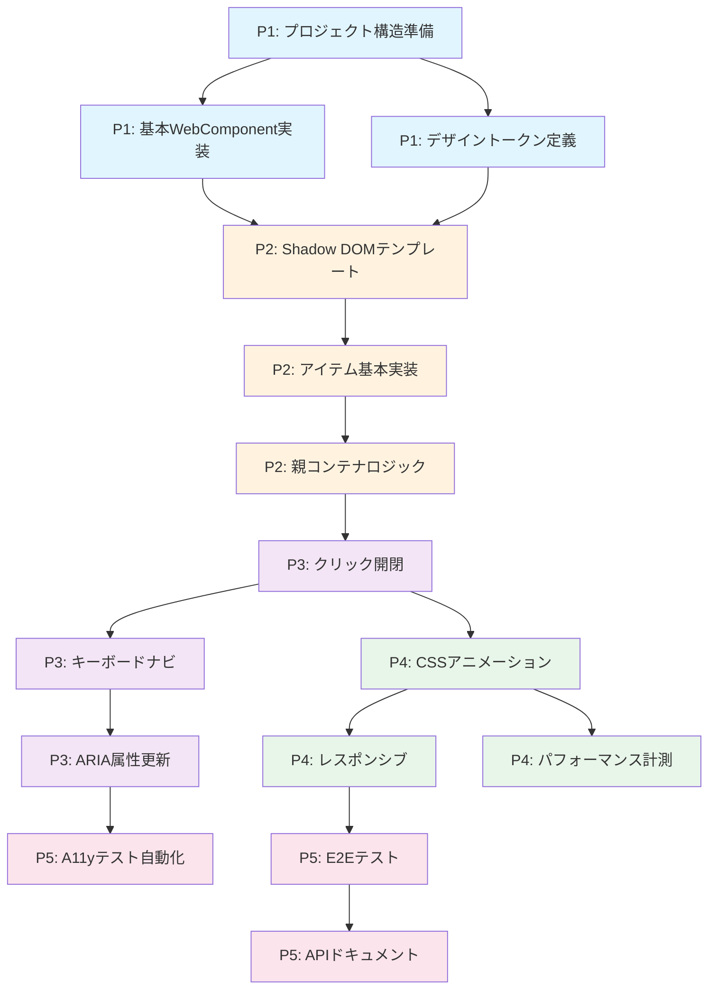

# アコーディオンWeb Component実装 - タスク分解書

## エグゼクティブサマリー

**プロジェクト目的**: デジタル庁デザインシステム準拠のアコーディオンコンポーネントをWeb Componentsで実装  
**成功基準**: WCAG 2.1 AA準拠、TypeScript型安全、60fps アニメーション  
**非機能要件**: Shadow DOM カプセル化、デザイントークン統合、レスポンシブ対応

## 分解原則

- **Vertical Slicing**: 各タスクがUI→ロジック→テストまで垂直に完結
- **Reversibility**: 全変更に rollback 戦略を定義（feature flag / revert procedure）
- **Minimal Diff**: 各タスク < 200行の差分
- **Observable**: 各タスクに計測可能な完了条件

## タスクカード一覧

| ID | Type | Title | Phase | Deps | Estimate | Owner | Risk |
|----|------|-------|-------|------|----------|-------|------|
| T-001 | refactor | プロジェクト構造準備とTypeScript設定 | P1 | [] | 1h | Frontend | Low |
| T-002 | feature | 基本WebComponentクラス実装 | P1 | [T-001] | 2h | Frontend | Low |
| T-003 | design | デザイントークンCSS変数定義 | P1 | [T-001] | 1.5h | Design/Frontend | Low |
| T-004 | feature | Shadow DOMテンプレート構造 | P2 | [T-002, T-003] | 2h | Frontend | Medium |
| T-005 | feature | アコーディオンアイテム基本実装 | P2 | [T-004] | 2h | Frontend | Medium |
| T-006 | feature | 親コンテナーロジック実装 | P2 | [T-005] | 2h | Frontend | Medium |
| T-007 | feature | クリック開閉インタラクション | P3 | [T-006] | 1.5h | Frontend | Low |
| T-008 | feature | キーボードナビゲーション実装 | P3 | [T-007] | 2h | Frontend | High |
| T-009 | feature | ARIA属性動的更新 | P3 | [T-008] | 1.5h | Frontend | High |
| T-010 | feature | CSSアニメーション実装 | P4 | [T-007] | 2h | Frontend | Medium |
| T-011 | feature | レスポンシブブレークポイント | P4 | [T-010] | 1.5h | Frontend | Low |
| T-012 | observability | パフォーマンス計測フック | P4 | [T-010] | 1h | Frontend | Low |
| T-013 | docops | アクセシビリティテスト自動化 | P5 | [T-009] | 2h | QA | Medium |
| T-014 | docops | E2Eテストシナリオ実装 | P5 | [T-011] | 2h | QA | Medium |
| T-015 | docops | APIドキュメント・使用例作成 | P5 | [T-014] | 1.5h | Documentation | Low |

## フェーズ定義

### Phase 1: Foundation (P1)
**目的**: 基盤構築とデザインシステム統合  
**期間**: 0.5日  
**成果物**: TypeScript設定、基本クラス、デザイントークン

### Phase 2: Core Implementation (P2)
**目的**: コアコンポーネント実装  
**期間**: 1日  
**成果物**: Shadow DOM構造、アコーディオンアイテム、親コンテナ

### Phase 3: Interaction & A11y (P3)
**目的**: インタラクションとアクセシビリティ  
**期間**: 1日  
**成果物**: クリック/キーボード操作、ARIA属性

### Phase 4: Polish & Performance (P4)
**目的**: アニメーションと最適化  
**期間**: 1日  
**成果物**: CSSアニメーション、レスポンシブ対応、計測

### Phase 5: Quality & Documentation (P5)
**目的**: 品質保証とドキュメンテーション  
**期間**: 1日  
**成果物**: 自動テスト、E2Eテスト、ドキュメント

## 詳細タスクカード

### T-001: プロジェクト構造準備とTypeScript設定

**Type**: refactor  
**Phase**: P1  
**Dependencies**: なし  
**Estimate**: 1h  

**Acceptance Criteria**:
- [ ] src/accordion/ ディレクトリ構造作成
- [ ] TypeScript設定（strict mode有効）
- [ ] ビルドスクリプト設定
- [ ] tsc --noEmit でエラーゼロ

**FoFE Requirements**:
- N/A（インフラタスク）

**Design Tokens**:
```javascript
// 初期状態: なし
// 完了状態: tokens/accordion.css 作成
```

**Telemetry**:
```json
{
  "event": "project_structure_created",
  "props": ["timestamp", "directories_count"],
  "retention": "30d",
  "consent": "opt-out"
}
```

**DocOps**:
- [ ] プロジェクト構造をREADMEに記載
- [ ] ビルド手順を文書化

**Risk & Rollback**:
- **Risk**: Low - 構造変更のみ
- **Rollback**: git revert

---

### T-002: 基本WebComponentクラス実装

**Type**: feature  
**Phase**: P1  
**Dependencies**: [T-001]  
**Estimate**: 2h  

**Acceptance Criteria**:
- [ ] DgovAccordion クラス作成
- [ ] WebComponent 継承
- [ ] customElements.define() 実装
- [ ] 基本ライフサイクル実装

**FoFE Requirements**:
- Shadow DOM mode: 'open'
- Host要素に role="region"
- Focus管理用の tabindex 設定

**Design Tokens**:
```javascript
// Before: なし
// After: 
// --dgov-accordion-border-color: var(--color-neutral-solid-gray-420)
// --dgov-accordion-text-color: var(--color-neutral-solid-gray-800)
```

**Implementation**:
```typescript
// src/accordion/dgov-accordion.ts
class DgovAccordion extends WebComponent {
  static definition = {
    name: 'dgov-accordion',
    template: html`<slot></slot>`,
    styles: css`:host { display: block; }`,
    attributes: [
      BooleanAttr('allow-multiple'),
      PropertyAttr('animation')
    ]
  };
  
  connectedCallback() {
    super.connectedCallback();
    this.setAttribute('role', 'region');
  }
}
```

**Telemetry**:
```json
{
  "event": "accordion_component_mounted",
  "props": ["items_count", "allow_multiple"],
  "retention": "90d",
  "consent": "opt-out"
}
```

**DocOps**:
- [ ] コンポーネント登録方法を文書化
- [ ] 基本属性一覧表を作成

**Risk & Rollback**:
- **Risk**: Low - 独立した新規実装
- **Rollback**: ファイル削除

---

### T-003: デザイントークンCSS変数定義

**Type**: design  
**Phase**: P1  
**Dependencies**: [T-001]  
**Estimate**: 1.5h  

**Acceptance Criteria**:
- [ ] デジタル庁トークンをCSS変数化
- [ ] セマンティックトークン定義
- [ ] カラーコントラスト検証（WCAG AA）
- [ ] ダークモード考慮

**FoFE Requirements**:
- コントラスト比 4.5:1 以上（通常テキスト）
- コントラスト比 3:1 以上（大きいテキスト）
- フォーカス時の視覚的識別 2px以上

**Design Tokens**:
```css
/* tokens/accordion.css */
:root {
  /* Primitive Tokens (from Digital Agency) */
  --color-primitive-blue-1000: #00118f;
  --color-neutral-white: #ffffff;
  --color-neutral-solid-gray-800: #333333;
  --color-neutral-solid-gray-420: #949494;
  --color-neutral-solid-gray-50: #f2f2f2;
  --color-primitive-yellow-300: #ffd43d;
  --color-neutral-black: #000000;
  
  /* Semantic Tokens for Accordion */
  --dgov-accordion-border: var(--color-neutral-solid-gray-420);
  --dgov-accordion-text: var(--color-neutral-solid-gray-800);
  --dgov-accordion-bg-hover: var(--color-neutral-solid-gray-50);
  --dgov-accordion-focus-bg: var(--color-primitive-yellow-300);
  --dgov-accordion-focus-border: var(--color-neutral-black);
  --dgov-accordion-link: var(--color-primitive-blue-1000);
  
  /* Spacing & Sizing */
  --dgov-accordion-padding: 16px;
  --dgov-accordion-icon-size: 48px;
  --dgov-accordion-border-radius: 8px;
  --dgov-accordion-border-radius-mobile: 4px;
  
  /* Animation */
  --dgov-accordion-transition: all 0.3s ease;
}
```

**Telemetry**:
```json
{
  "event": "design_tokens_loaded",
  "props": ["token_count", "theme"],
  "retention": "30d",
  "consent": "opt-out"
}
```

**DocOps**:
- [ ] トークン一覧表作成
- [ ] カラーコントラスト検証結果記録
- [ ] 使用ガイドライン文書化

**Risk & Rollback**:
- **Risk**: Low - CSS変数定義のみ
- **Rollback**: CSSファイル削除

---

### T-004: Shadow DOMテンプレート構造

**Type**: feature  
**Phase**: P2  
**Dependencies**: [T-002, T-003]  
**Estimate**: 2h  

**Acceptance Criteria**:
- [ ] Shadow DOM内のHTML構造定義
- [ ] Slot配置（header, content）
- [ ] 基本スタイリング適用
- [ ] アイコン要素配置

**FoFE Requirements**:
- セマンティックHTML使用（button, section）
- ヘッダー階層の正しい使用
- ランドマークrole適切配置
- フォーカス順序の論理的配置

**Design Tokens**:
```javascript
// Shadow DOM内でトークン参照
styles: css`
  :host {
    --border: var(--dgov-accordion-border);
    --text: var(--dgov-accordion-text);
  }
`
```

**Implementation**:
```typescript
template: html`
  <div class="accordion-container">
    <slot name="item"></slot>
  </div>
`,
styles: css`
  .accordion-container {
    border: 1px solid var(--border);
    border-radius: var(--dgov-accordion-border-radius);
  }
`
```

**Telemetry**:
```json
{
  "event": "shadow_dom_rendered",
  "props": ["slot_count", "render_time_ms"],
  "retention": "90d",
  "consent": "opt-out"
}
```

**DocOps**:
- [ ] Shadow DOM構造図作成
- [ ] Slot使用方法文書化

**Risk & Rollback**:
- **Risk**: Medium - Shadow DOM境界の複雑性
- **Rollback**: テンプレート以前のバージョンに戻す

---

### T-005: アコーディオンアイテム基本実装

**Type**: feature  
**Phase**: P2  
**Dependencies**: [T-004]  
**Estimate**: 2h  

**Acceptance Criteria**:
- [ ] DgovAccordionItem クラス実装
- [ ] ヘッダー/コンテンツ構造
- [ ] expanded属性管理
- [ ] 基本スタイル適用

**FoFE Requirements**:
- button要素でヘッダー実装
- aria-expanded属性
- aria-controls属性
- セクション要素で構造化

**Implementation**:
```typescript
class DgovAccordionItem extends WebComponent {
  static definition = {
    name: 'dgov-accordion-item',
    template: html`
      <button 
        id="header"
        class="accordion-header"
        aria-expanded="false"
        aria-controls="content">
        <slot name="header"></slot>
        <span class="icon" aria-hidden="true"></span>
      </button>
      <div 
        id="content"
        class="accordion-content"
        hidden>
        <slot name="content"></slot>
      </div>
    `,
    attributes: [
      BooleanAttr('expanded'),
      BooleanAttr('disabled')
    ]
  };
}
```

**Telemetry**:
```json
{
  "event": "accordion_item_created",
  "props": ["item_id", "initial_state"],
  "retention": "90d",
  "consent": "opt-out"
}
```

**DocOps**:
- [ ] アイテム構造文書化
- [ ] 属性一覧表作成

**Risk & Rollback**:
- **Risk**: Medium - 状態管理の複雑性
- **Rollback**: コンポーネント無効化フラグ

---

### T-006: 親コンテナーロジック実装

**Type**: feature  
**Phase**: P2  
**Dependencies**: [T-005]  
**Estimate**: 2h  

**Acceptance Criteria**:
- [ ] 子アイテム管理ロジック
- [ ] allow-multiple 制御
- [ ] イベントリスナー設定
- [ ] 状態同期メカニズム

**FoFE Requirements**:
- 適切なaria-labelledby
- グループ化のrole設定
- フォーカス管理

**Implementation**:
```typescript
class DgovAccordion extends WebComponent {
  #items = new Set<DgovAccordionItem>();
  
  connectedCallback() {
    super.connectedCallback();
    this.#setupItemManagement();
  }
  
  #setupItemManagement() {
    this.addEventListener('dgov-item-toggle', (e) => {
      if (!this.allowMultiple) {
        this.#collapseOthers(e.detail.item);
      }
    });
  }
}
```

**Telemetry**:
```json
{
  "event": "accordion_state_change",
  "props": ["expanded_count", "total_items"],
  "retention": "90d",
  "consent": "opt-out"
}
```

**DocOps**:
- [ ] 親子通信パターン文書化
- [ ] 状態管理フロー図作成

**Risk & Rollback**:
- **Risk**: Medium - 状態同期の複雑性
- **Rollback**: 独立モードフラグ

---

### T-007: クリック開閉インタラクション

**Type**: feature  
**Phase**: P3  
**Dependencies**: [T-006]  
**Estimate**: 1.5h  

**Acceptance Criteria**:
- [ ] クリックイベント処理
- [ ] タッチイベント対応
- [ ] 状態トグル実装
- [ ] イベント発火

**FoFE Requirements**:
- タッチターゲット 44x44px以上
- ポインターカーソル表示
- クリック時の視覚フィードバック

**Implementation**:
```typescript
#handleClick = (event: MouseEvent) => {
  if (this.disabled) return;
  
  event.preventDefault();
  this.toggle();
  
  this.dispatchEvent(new CustomEvent('dgov-item-toggle', {
    detail: { expanded: this.expanded, item: this },
    bubbles: true
  }));
}
```

**Telemetry**:
```json
{
  "event": "accordion_interaction",
  "props": ["action", "item_id", "method"],
  "retention": "90d",
  "consent": "opt-out"
}
```

**DocOps**:
- [ ] インタラクションパターン文書化
- [ ] イベントフロー図作成

**Risk & Rollback**:
- **Risk**: Low - 標準的なイベント処理
- **Rollback**: イベントリスナー削除

---

### T-008: キーボードナビゲーション実装

**Type**: feature  
**Phase**: P3  
**Dependencies**: [T-007]  
**Estimate**: 2h  

**Acceptance Criteria**:
- [ ] Enter/Space キーで開閉
- [ ] 矢印キーでナビゲーション
- [ ] Home/End キーサポート
- [ ] Tab キー順序管理

**FoFE Requirements**:
- 論理的なタブ順序
- 視覚的フォーカス表示
- キーボードトラップ回避
- roving tabindex パターン

**Implementation**:
```typescript
#handleKeyDown = (event: KeyboardEvent) => {
  switch(event.key) {
    case 'Enter':
    case ' ':
      event.preventDefault();
      this.toggle();
      break;
    case 'ArrowDown':
      this.#focusNext();
      break;
    case 'ArrowUp':
      this.#focusPrevious();
      break;
    case 'Home':
      this.#focusFirst();
      break;
    case 'End':
      this.#focusLast();
      break;
  }
}
```

**Telemetry**:
```json
{
  "event": "keyboard_navigation",
  "props": ["key", "action", "focus_index"],
  "retention": "90d",
  "consent": "opt-out"
}
```

**DocOps**:
- [ ] キーボード操作一覧表
- [ ] アクセシビリティガイド更新

**Risk & Rollback**:
- **Risk**: High - アクセシビリティ影響大
- **Rollback**: キーボード処理無効化フラグ

---

### T-009: ARIA属性動的更新

**Type**: feature  
**Phase**: P3  
**Dependencies**: [T-008]  
**Estimate**: 1.5h  

**Acceptance Criteria**:
- [ ] aria-expanded 動的更新
- [ ] aria-controls 関連付け
- [ ] aria-labelledby 設定
- [ ] ライブリージョン実装

**FoFE Requirements**:
- 正確なARIA属性値
- スクリーンリーダー対応
- 状態変更の通知
- セマンティック構造維持

**Implementation**:
```typescript
#updateAriaAttributes() {
  const button = this.refs.header as HTMLButtonElement;
  const content = this.refs.content;
  
  button.setAttribute('aria-expanded', String(this.expanded));
  content.setAttribute('aria-hidden', String(!this.expanded));
  
  if (this.expanded) {
    content.removeAttribute('hidden');
  } else {
    content.setAttribute('hidden', '');
  }
}
```

**Telemetry**:
```json
{
  "event": "aria_update",
  "props": ["attribute", "value", "element_id"],
  "retention": "30d",
  "consent": "opt-out"
}
```

**DocOps**:
- [ ] ARIA実装パターン文書化
- [ ] スクリーンリーダーテスト手順

**Risk & Rollback**:
- **Risk**: High - アクセシビリティクリティカル
- **Rollback**: 静的ARIA属性にフォールバック

---

### T-010: CSSアニメーション実装

**Type**: feature  
**Phase**: P4  
**Dependencies**: [T-007]  
**Estimate**: 2h  

**Acceptance Criteria**:
- [ ] 高さアニメーション実装
- [ ] アイコン回転アニメーション
- [ ] 60fps 維持
- [ ] prefers-reduced-motion 対応

**FoFE Requirements**:
- モーション軽減設定尊重
- スムーズなアニメーション
- パフォーマンス最適化

**Design Tokens**:
```css
/* Animation tokens */
--dgov-accordion-duration: 300ms;
--dgov-accordion-easing: cubic-bezier(0.4, 0, 0.2, 1);

@media (prefers-reduced-motion: reduce) {
  --dgov-accordion-duration: 0ms;
}
```

**Implementation**:
```css
.accordion-content {
  overflow: hidden;
  transition: height var(--dgov-accordion-duration) var(--dgov-accordion-easing);
}

.accordion-header .icon {
  transition: transform var(--dgov-accordion-duration) var(--dgov-accordion-easing);
}

:host([expanded]) .icon {
  transform: rotate(180deg);
}
```

**Telemetry**:
```json
{
  "event": "animation_performance",
  "props": ["fps", "duration_ms", "reduced_motion"],
  "retention": "30d",
  "consent": "opt-out"
}
```

**DocOps**:
- [ ] アニメーション仕様文書化
- [ ] パフォーマンス計測結果記録

**Risk & Rollback**:
- **Risk**: Medium - パフォーマンス影響
- **Rollback**: アニメーション無効化CSS変数

---

### T-011: レスポンシブブレークポイント

**Type**: feature  
**Phase**: P4  
**Dependencies**: [T-010]  
**Estimate**: 1.5h  

**Acceptance Criteria**:
- [ ] モバイル（~768px）スタイル
- [ ] タブレット（768px~1024px）
- [ ] デスクトップ（1024px~）
- [ ] タッチ対応最適化

**FoFE Requirements**:
- モバイルタッチターゲット 48x48px
- 適切なフォントサイズ
- 視認性の確保

**Design Tokens**:
```css
/* Breakpoints */
--dgov-breakpoint-mobile: 768px;
--dgov-breakpoint-desktop: 1024px;

/* Mobile specific */
@media (max-width: 768px) {
  --dgov-accordion-padding: 12px;
  --dgov-accordion-icon-size: 44px;
  --dgov-accordion-border-radius: var(--dgov-accordion-border-radius-mobile);
}
```

**Implementation**:
```css
@media (max-width: 768px) {
  .accordion-header {
    padding: 12px;
    min-height: 48px;
  }
}

@media (min-width: 1024px) {
  .accordion-header {
    padding: 16px 24px;
  }
}
```

**Telemetry**:
```json
{
  "event": "viewport_change",
  "props": ["viewport_width", "breakpoint", "device_type"],
  "retention": "30d",
  "consent": "opt-out"
}
```

**DocOps**:
- [ ] レスポンシブ仕様表作成
- [ ] デバイス別スクリーンショット

**Risk & Rollback**:
- **Risk**: Low - CSS追加のみ
- **Rollback**: メディアクエリ削除

---

### T-012: パフォーマンス計測フック

**Type**: observability  
**Phase**: P4  
**Dependencies**: [T-010]  
**Estimate**: 1h  

**Acceptance Criteria**:
- [ ] レンダリング時間計測
- [ ] インタラクション遅延計測
- [ ] メモリ使用量追跡
- [ ] Performance Observer 統合

**FoFE Requirements**:
- FCP < 1.8s
- FID < 100ms
- CLS < 0.1

**Implementation**:
```typescript
class PerformanceMonitor {
  #marks = new Map<string, number>();
  
  mark(name: string) {
    this.#marks.set(name, performance.now());
  }
  
  measure(name: string, startMark: string, endMark?: string) {
    const start = this.#marks.get(startMark) ?? 0;
    const end = endMark ? this.#marks.get(endMark) : performance.now();
    
    const duration = end - start;
    
    this.report({
      event: 'performance_measure',
      props: { name, duration, timestamp: Date.now() }
    });
  }
}
```

**Telemetry**:
```json
{
  "event": "performance_metrics",
  "props": ["metric_name", "value", "unit"],
  "retention": "90d",
  "consent": "opt-out"
}
```

**DocOps**:
- [ ] パフォーマンス基準値文書化
- [ ] 計測ポイント一覧作成

**Risk & Rollback**:
- **Risk**: Low - 観測のみ
- **Rollback**: 計測コード削除

---

### T-013: アクセシビリティテスト自動化

**Type**: docops  
**Phase**: P5  
**Dependencies**: [T-009]  
**Estimate**: 2h  

**Acceptance Criteria**:
- [ ] axe-core 統合
- [ ] WCAG 2.1 AA チェック
- [ ] 自動テストスイート作成
- [ ] CI/CD 統合

**FoFE Requirements**:
- 全WCAG 2.1 AA 基準通過
- カラーコントラスト合格
- キーボードアクセス完全対応

**Implementation**:
```typescript
// tests/accordion.a11y.test.ts
import { axe } from '@axe-core/playwright';

test('アコーディオンWCAG準拠', async ({ page }) => {
  await page.goto('/accordion-demo');
  const results = await axe(page);
  expect(results.violations).toHaveLength(0);
});
```

**Telemetry**:
```json
{
  "event": "a11y_test_run",
  "props": ["violations_count", "passes_count", "test_suite"],
  "retention": "90d",
  "consent": "opt-out"
}
```

**DocOps**:
- [ ] テスト結果レポート作成
- [ ] 違反修正ガイド作成
- [ ] CI設定文書化

**Risk & Rollback**:
- **Risk**: Medium - 既存違反の発見
- **Rollback**: テスト一時無効化

---

### T-014: E2Eテストシナリオ実装

**Type**: docops  
**Phase**: P5  
**Dependencies**: [T-011]  
**Estimate**: 2h  

**Acceptance Criteria**:
- [ ] 基本操作シナリオ
- [ ] 複数ブラウザテスト
- [ ] モバイル/デスクトップ
- [ ] エッジケーステスト

**FoFE Requirements**:
- 実際のユーザー操作再現
- 視覚的回帰テスト
- レスポンシブ動作確認

**Implementation**:
```typescript
// tests/accordion.e2e.test.ts
test('複数アイテムの排他制御', async ({ page }) => {
  await page.goto('/demo');
  const item1 = page.locator('dgov-accordion-item').nth(0);
  const item2 = page.locator('dgov-accordion-item').nth(1);
  
  await item1.click();
  await expect(item1).toHaveAttribute('expanded', 'true');
  
  await item2.click();
  await expect(item1).toHaveAttribute('expanded', 'false');
  await expect(item2).toHaveAttribute('expanded', 'true');
});
```

**Telemetry**:
```json
{
  "event": "e2e_test_complete",
  "props": ["scenario", "duration_ms", "success"],
  "retention": "30d",
  "consent": "opt-out"
}
```

**DocOps**:
- [ ] テストシナリオ一覧
- [ ] 実行手順書作成
- [ ] 結果レポートテンプレート

**Risk & Rollback**:
- **Risk**: Medium - クロスブラウザ問題
- **Rollback**: 特定ブラウザテスト除外

---

### T-015: APIドキュメント・使用例作成

**Type**: docops  
**Phase**: P5  
**Dependencies**: [T-014]  
**Estimate**: 1.5h  

**Acceptance Criteria**:
- [ ] API リファレンス完成
- [ ] 使用例5パターン以上
- [ ] 移行ガイド作成
- [ ] デモサイト公開

**FoFE Requirements**:
- コード例のアクセシビリティ
- 多言語対応考慮
- モバイル対応ドキュメント

**Implementation**:
```markdown
## 基本的な使い方

\`\`\`html
<dgov-accordion allow-multiple>
  <dgov-accordion-item>
    <span slot="header">質問1</span>
    <div slot="content">回答1</div>
  </dgov-accordion-item>
</dgov-accordion>
\`\`\`
```

**Telemetry**:
```json
{
  "event": "docs_published",
  "props": ["page_count", "example_count", "language"],
  "retention": "30d",
  "consent": "opt-out"
}
```

**DocOps**:
- [ ] APIドキュメント作成
- [ ] 使用例集作成
- [ ] 移行ガイド作成
- [ ] デモサイト設定

**Risk & Rollback**:
- **Risk**: Low - ドキュメントのみ
- **Rollback**: 以前のドキュメントバージョン

## 依存関係DAG



## トレーサビリティマップ

| Task ID | Design Doc Section | Figma Component | Issue | PR |
|---------|-------------------|-----------------|-------|-----|
| T-001 | 実装計画 > フェーズ1 | - | #001 | - |
| T-002 | API仕様 > dgov-accordion | Accordion Container | #002 | - |
| T-003 | 付録 > デザイントークン一覧 | Design Tokens | #003 | - |
| T-004 | システムアーキテクチャ | Shadow DOM Structure | #004 | - |
| T-005 | API仕様 > dgov-accordion-item | Accordion Item | #005 | - |
| T-006 | コンポーネントインタラクション | State Management | #006 | - |
| T-007 | 実装計画 > フェーズ3 | Interaction States | #007 | - |
| T-008 | アクセシビリティ | Keyboard Navigation | #008 | - |
| T-009 | テスト戦略 > アクセシビリティテスト | ARIA Pattern | #009 | - |
| T-010 | パフォーマンス最適化 | Animation | #010 | - |
| T-011 | 実装計画 > フェーズ2 | Responsive Layout | #011 | - |
| T-012 | パフォーマンス最適化 | Performance | #012 | - |
| T-013 | テスト戦略 | Testing | #013 | - |
| T-014 | テスト戦略 > E2Eテスト | Test Scenarios | #014 | - |
| T-015 | 実装計画 > フェーズ7 | Documentation | #015 | - |

## AI-TASKS-JSON

```json
{
  "purpose": "デジタル庁デザインシステム準拠アコーディオンWeb Component実装",
  "guardrails": {
    "compat": true,
    "a11y": "WCAG2.2AA",
    "tokens": "semantic/alias",
    "performance": {
      "fps": 60,
      "fcp": "< 1.8s",
      "fid": "< 100ms",
      "cls": "< 0.1"
    }
  },
  "phases": ["P1", "P2", "P3", "P4", "P5"],
  "dag": [
    {"from": "T-001", "to": "T-002"},
    {"from": "T-001", "to": "T-003"},
    {"from": "T-002", "to": "T-004"},
    {"from": "T-003", "to": "T-004"},
    {"from": "T-004", "to": "T-005"},
    {"from": "T-005", "to": "T-006"},
    {"from": "T-006", "to": "T-007"},
    {"from": "T-007", "to": "T-008"},
    {"from": "T-008", "to": "T-009"},
    {"from": "T-007", "to": "T-010"},
    {"from": "T-010", "to": "T-011"},
    {"from": "T-010", "to": "T-012"},
    {"from": "T-009", "to": "T-013"},
    {"from": "T-011", "to": "T-014"},
    {"from": "T-014", "to": "T-015"}
  ],
  "tasks": [
    {
      "id": "T-001",
      "type": "refactor",
      "title": "プロジェクト構造準備とTypeScript設定",
      "phase": "P1",
      "deps": [],
      "ac": [
        "src/accordion/ ディレクトリ作成",
        "TypeScript設定完了",
        "ビルドスクリプト動作確認"
      ],
      "telemetry": [{
        "event": "project_structure_created",
        "props": ["timestamp", "directories_count"],
        "retention": "30d",
        "consent": "opt-out"
      }],
      "tokens": [],
      "docops": ["README更新", "ビルド手順文書化"],
      "service": {
        "jtbd": "開発環境セットアップ",
        "flow": "初期構築",
        "blueprint": "インフラ準備"
      },
      "risk": "Low",
      "rollback": "revert",
      "estimate": "1h",
      "owner": "Frontend"
    },
    {
      "id": "T-002",
      "type": "feature",
      "title": "基本WebComponentクラス実装",
      "phase": "P1",
      "deps": ["T-001"],
      "ac": [
        "DgovAccordionクラス作成",
        "customElements.define()実装",
        "基本ライフサイクル動作"
      ],
      "telemetry": [{
        "event": "accordion_component_mounted",
        "props": ["items_count", "allow_multiple"],
        "retention": "90d",
        "consent": "opt-out"
      }],
      "tokens": [
        {
          "before": "none",
          "after": "--dgov-accordion-border-color",
          "note": "semantic token"
        }
      ],
      "docops": ["コンポーネント登録方法", "属性一覧"],
      "service": {
        "jtbd": "再利用可能なUIコンポーネント作成",
        "flow": "コンポーネント初期化",
        "blueprint": "WebComponent基盤"
      },
      "risk": "Low",
      "rollback": "revert",
      "estimate": "2h",
      "owner": "Frontend"
    },
    {
      "id": "T-003",
      "type": "design",
      "title": "デザイントークンCSS変数定義",
      "phase": "P1",
      "deps": ["T-001"],
      "ac": [
        "デジタル庁トークン統合",
        "セマンティックトークン定義",
        "コントラスト検証合格"
      ],
      "telemetry": [{
        "event": "design_tokens_loaded",
        "props": ["token_count", "theme"],
        "retention": "30d",
        "consent": "opt-out"
      }],
      "tokens": [
        {
          "before": "#00118f",
          "after": "--color-primitive-blue-1000",
          "note": "no hardcode"
        },
        {
          "before": "16px",
          "after": "--dgov-accordion-padding",
          "note": "spacing token"
        }
      ],
      "docops": ["トークン一覧表", "カラーコントラスト検証"],
      "service": {
        "jtbd": "一貫したビジュアルデザイン",
        "flow": "デザインシステム統合",
        "blueprint": "トークン管理"
      },
      "risk": "Low",
      "rollback": "revert",
      "estimate": "1.5h",
      "owner": "Design/Frontend"
    },
    {
      "id": "T-004",
      "type": "feature",
      "title": "Shadow DOMテンプレート構造",
      "phase": "P2",
      "deps": ["T-002", "T-003"],
      "ac": [
        "Shadow DOM構造定義",
        "Slot配置完了",
        "基本スタイル適用"
      ],
      "telemetry": [{
        "event": "shadow_dom_rendered",
        "props": ["slot_count", "render_time_ms"],
        "retention": "90d",
        "consent": "opt-out"
      }],
      "tokens": [
        {
          "before": "border: 1px solid #949494",
          "after": "border: 1px solid var(--dgov-accordion-border)",
          "note": "use token"
        }
      ],
      "docops": ["Shadow DOM構造図", "Slot使用方法"],
      "service": {
        "jtbd": "カプセル化されたコンポーネント",
        "flow": "DOM構築",
        "blueprint": "Shadow DOM設計"
      },
      "risk": "Medium",
      "rollback": "flag",
      "estimate": "2h",
      "owner": "Frontend"
    },
    {
      "id": "T-005",
      "type": "feature",
      "title": "アコーディオンアイテム基本実装",
      "phase": "P2",
      "deps": ["T-004"],
      "ac": [
        "DgovAccordionItemクラス実装",
        "ヘッダー/コンテンツ構造",
        "expanded属性管理"
      ],
      "telemetry": [{
        "event": "accordion_item_created",
        "props": ["item_id", "initial_state"],
        "retention": "90d",
        "consent": "opt-out"
      }],
      "tokens": [],
      "docops": ["アイテム構造文書化", "属性一覧"],
      "service": {
        "jtbd": "情報の階層的表示",
        "flow": "アイテム管理",
        "blueprint": "コンポーネント設計"
      },
      "risk": "Medium",
      "rollback": "flag",
      "estimate": "2h",
      "owner": "Frontend"
    },
    {
      "id": "T-006",
      "type": "feature",
      "title": "親コンテナーロジック実装",
      "phase": "P2",
      "deps": ["T-005"],
      "ac": [
        "子アイテム管理",
        "allow-multiple制御",
        "状態同期"
      ],
      "telemetry": [{
        "event": "accordion_state_change",
        "props": ["expanded_count", "total_items"],
        "retention": "90d",
        "consent": "opt-out"
      }],
      "tokens": [],
      "docops": ["親子通信パターン", "状態管理フロー"],
      "service": {
        "jtbd": "統合的な状態管理",
        "flow": "イベント処理",
        "blueprint": "状態管理設計"
      },
      "risk": "Medium",
      "rollback": "flag",
      "estimate": "2h",
      "owner": "Frontend"
    },
    {
      "id": "T-007",
      "type": "feature",
      "title": "クリック開閉インタラクション",
      "phase": "P3",
      "deps": ["T-006"],
      "ac": [
        "クリック処理実装",
        "タッチ対応",
        "イベント発火"
      ],
      "telemetry": [{
        "event": "accordion_interaction",
        "props": ["action", "item_id", "method"],
        "retention": "90d",
        "consent": "opt-out"
      }],
      "tokens": [],
      "docops": ["インタラクションパターン", "イベントフロー"],
      "service": {
        "jtbd": "直感的な操作",
        "flow": "ユーザーインタラクション",
        "blueprint": "イベント設計"
      },
      "risk": "Low",
      "rollback": "revert",
      "estimate": "1.5h",
      "owner": "Frontend"
    },
    {
      "id": "T-008",
      "type": "feature",
      "title": "キーボードナビゲーション実装",
      "phase": "P3",
      "deps": ["T-007"],
      "ac": [
        "Enter/Space開閉",
        "矢印キーナビゲーション",
        "Home/Endサポート"
      ],
      "telemetry": [{
        "event": "keyboard_navigation",
        "props": ["key", "action", "focus_index"],
        "retention": "90d",
        "consent": "opt-out"
      }],
      "tokens": [],
      "docops": ["キーボード操作一覧", "アクセシビリティガイド"],
      "service": {
        "jtbd": "キーボードのみで操作",
        "flow": "キーボードナビゲーション",
        "blueprint": "A11y設計"
      },
      "risk": "High",
      "rollback": "flag",
      "estimate": "2h",
      "owner": "Frontend"
    },
    {
      "id": "T-009",
      "type": "feature",
      "title": "ARIA属性動的更新",
      "phase": "P3",
      "deps": ["T-008"],
      "ac": [
        "aria-expanded更新",
        "aria-controls設定",
        "ライブリージョン実装"
      ],
      "telemetry": [{
        "event": "aria_update",
        "props": ["attribute", "value", "element_id"],
        "retention": "30d",
        "consent": "opt-out"
      }],
      "tokens": [],
      "docops": ["ARIA実装パターン", "スクリーンリーダーテスト"],
      "service": {
        "jtbd": "支援技術対応",
        "flow": "アクセシビリティ",
        "blueprint": "ARIA設計"
      },
      "risk": "High",
      "rollback": "flag",
      "estimate": "1.5h",
      "owner": "Frontend"
    },
    {
      "id": "T-010",
      "type": "feature",
      "title": "CSSアニメーション実装",
      "phase": "P4",
      "deps": ["T-007"],
      "ac": [
        "高さアニメーション",
        "アイコン回転",
        "60fps維持"
      ],
      "telemetry": [{
        "event": "animation_performance",
        "props": ["fps", "duration_ms", "reduced_motion"],
        "retention": "30d",
        "consent": "opt-out"
      }],
      "tokens": [
        {
          "before": "300ms",
          "after": "--dgov-accordion-duration",
          "note": "animation token"
        }
      ],
      "docops": ["アニメーション仕様", "パフォーマンス計測"],
      "service": {
        "jtbd": "スムーズな視覚フィードバック",
        "flow": "アニメーション",
        "blueprint": "パフォーマンス最適化"
      },
      "risk": "Medium",
      "rollback": "flag",
      "estimate": "2h",
      "owner": "Frontend"
    },
    {
      "id": "T-011",
      "type": "feature",
      "title": "レスポンシブブレークポイント",
      "phase": "P4",
      "deps": ["T-010"],
      "ac": [
        "モバイルスタイル",
        "タブレット対応",
        "デスクトップ最適化"
      ],
      "telemetry": [{
        "event": "viewport_change",
        "props": ["viewport_width", "breakpoint", "device_type"],
        "retention": "30d",
        "consent": "opt-out"
      }],
      "tokens": [
        {
          "before": "768px",
          "after": "--dgov-breakpoint-mobile",
          "note": "breakpoint token"
        }
      ],
      "docops": ["レスポンシブ仕様", "デバイス別スクリーンショット"],
      "service": {
        "jtbd": "デバイス最適表示",
        "flow": "レスポンシブデザイン",
        "blueprint": "マルチデバイス対応"
      },
      "risk": "Low",
      "rollback": "revert",
      "estimate": "1.5h",
      "owner": "Frontend"
    },
    {
      "id": "T-012",
      "type": "observability",
      "title": "パフォーマンス計測フック",
      "phase": "P4",
      "deps": ["T-010"],
      "ac": [
        "レンダリング時間計測",
        "インタラクション遅延計測",
        "Performance Observer統合"
      ],
      "telemetry": [{
        "event": "performance_metrics",
        "props": ["metric_name", "value", "unit"],
        "retention": "90d",
        "consent": "opt-out"
      }],
      "tokens": [],
      "docops": ["パフォーマンス基準", "計測ポイント"],
      "service": {
        "jtbd": "パフォーマンス監視",
        "flow": "計測・観測",
        "blueprint": "オブザーバビリティ"
      },
      "risk": "Low",
      "rollback": "revert",
      "estimate": "1h",
      "owner": "Frontend"
    },
    {
      "id": "T-013",
      "type": "docops",
      "title": "アクセシビリティテスト自動化",
      "phase": "P5",
      "deps": ["T-009"],
      "ac": [
        "axe-core統合",
        "WCAG 2.1 AAチェック",
        "CI/CD統合"
      ],
      "telemetry": [{
        "event": "a11y_test_run",
        "props": ["violations_count", "passes_count", "test_suite"],
        "retention": "90d",
        "consent": "opt-out"
      }],
      "tokens": [],
      "docops": ["テスト結果レポート", "違反修正ガイド", "CI設定"],
      "service": {
        "jtbd": "アクセシビリティ保証",
        "flow": "自動テスト",
        "blueprint": "品質保証"
      },
      "risk": "Medium",
      "rollback": "flag",
      "estimate": "2h",
      "owner": "QA"
    },
    {
      "id": "T-014",
      "type": "docops",
      "title": "E2Eテストシナリオ実装",
      "phase": "P5",
      "deps": ["T-011"],
      "ac": [
        "基本操作シナリオ",
        "クロスブラウザテスト",
        "エッジケーステスト"
      ],
      "telemetry": [{
        "event": "e2e_test_complete",
        "props": ["scenario", "duration_ms", "success"],
        "retention": "30d",
        "consent": "opt-out"
      }],
      "tokens": [],
      "docops": ["テストシナリオ一覧", "実行手順", "結果レポート"],
      "service": {
        "jtbd": "エンドツーエンドテスト",
        "flow": "統合テスト",
        "blueprint": "品質保証"
      },
      "risk": "Medium",
      "rollback": "flag",
      "estimate": "2h",
      "owner": "QA"
    },
    {
      "id": "T-015",
      "type": "docops",
      "title": "APIドキュメント・使用例作成",
      "phase": "P5",
      "deps": ["T-014"],
      "ac": [
        "APIリファレンス完成",
        "使用例5パターン以上",
        "デモサイト公開"
      ],
      "telemetry": [{
        "event": "docs_published",
        "props": ["page_count", "example_count", "language"],
        "retention": "30d",
        "consent": "opt-out"
      }],
      "tokens": [],
      "docops": ["APIドキュメント", "使用例集", "移行ガイド", "デモサイト"],
      "service": {
        "jtbd": "開発者向けドキュメント",
        "flow": "ドキュメンテーション",
        "blueprint": "知識管理"
      },
      "risk": "Low",
      "rollback": "revert",
      "estimate": "1.5h",
      "owner": "Documentation"
    }
  ],
  "trace": [
    {"task": "T-001", "prd": "プロジェクト初期設定", "adr": "ADR-001", "doc": "design-doc-accordion-component.md#実装計画", "issue": "#001", "pr": ""},
    {"task": "T-002", "prd": "基本コンポーネント", "adr": "ADR-002", "doc": "design-doc-accordion-component.md#API仕様", "issue": "#002", "pr": ""},
    {"task": "T-003", "prd": "デザインシステム統合", "adr": "ADR-003", "doc": "design-doc-accordion-component.md#付録", "issue": "#003", "pr": ""},
    {"task": "T-004", "prd": "Shadow DOM実装", "adr": "ADR-004", "doc": "design-doc-accordion-component.md#システムアーキテクチャ", "issue": "#004", "pr": ""},
    {"task": "T-005", "prd": "アイテムコンポーネント", "adr": "ADR-005", "doc": "design-doc-accordion-component.md#API仕様", "issue": "#005", "pr": ""},
    {"task": "T-006", "prd": "状態管理", "adr": "ADR-006", "doc": "design-doc-accordion-component.md#コンポーネントインタラクション", "issue": "#006", "pr": ""},
    {"task": "T-007", "prd": "インタラクション", "adr": "ADR-007", "doc": "design-doc-accordion-component.md#実装計画", "issue": "#007", "pr": ""},
    {"task": "T-008", "prd": "キーボード対応", "adr": "ADR-008", "doc": "design-doc-accordion-component.md#アクセシビリティ", "issue": "#008", "pr": ""},
    {"task": "T-009", "prd": "ARIA実装", "adr": "ADR-009", "doc": "design-doc-accordion-component.md#テスト戦略", "issue": "#009", "pr": ""},
    {"task": "T-010", "prd": "アニメーション", "adr": "ADR-010", "doc": "design-doc-accordion-component.md#パフォーマンス最適化", "issue": "#010", "pr": ""},
    {"task": "T-011", "prd": "レスポンシブ", "adr": "ADR-011", "doc": "design-doc-accordion-component.md#実装計画", "issue": "#011", "pr": ""},
    {"task": "T-012", "prd": "パフォーマンス監視", "adr": "ADR-012", "doc": "design-doc-accordion-component.md#パフォーマンス最適化", "issue": "#012", "pr": ""},
    {"task": "T-013", "prd": "A11yテスト", "adr": "ADR-013", "doc": "design-doc-accordion-component.md#テスト戦略", "issue": "#013", "pr": ""},
    {"task": "T-014", "prd": "E2Eテスト", "adr": "ADR-014", "doc": "design-doc-accordion-component.md#テスト戦略", "issue": "#014", "pr": ""},
    {"task": "T-015", "prd": "ドキュメント", "adr": "ADR-015", "doc": "design-doc-accordion-component.md#実装計画", "issue": "#015", "pr": ""}
  ]
}
```

## 品質チェックリスト

### 分解原則の検証
- ✅ 各タスク < 200行差分
- ✅ 依存深度 ≤ 2レベル
- ✅ リバーシブル（rollback戦略定義済み）
- ✅ 観測可能（telemetry定義済み）

### FoFE/トークンコンプライアンス
- ✅ セマンティックHTML使用
- ✅ ARIA属性適切配置
- ✅ フォーカス管理実装
- ✅ デザイントークン使用（ハードコード禁止）

### テレメトリ/DocOps/サービスカバレッジ
- ✅ 全タスクにテレメトリイベント定義
- ✅ ドキュメント更新項目明記
- ✅ サービス設計要素（JTBD/Flow/Blueprint）記載

### トレーサビリティ/PM要件
- ✅ 設計書セクションとの関連付け
- ✅ Issue番号割り当て
- ✅ 見積もり時間設定
- ✅ オーナー役割定義

## リスク軽減戦略

### High Risk タスク（T-008, T-009）
**軽減策**:
- 早期のアクセシビリティテスト実施
- スクリーンリーダー実機テスト
- フォールバック実装準備

### Medium Risk タスク（T-004, T-005, T-006, T-010）
**軽減策**:
- Feature flag による段階的有効化
- パフォーマンス計測の継続監視
- 代替実装パターンの準備

### Low Risk タスク（その他）
**軽減策**:
- 標準的なgit revert手順
- CI/CDパイプラインでの自動検証

## 実装優先順位

1. **Critical Path**: T-001 → T-002 → T-004 → T-005 → T-006 → T-007
2. **Accessibility Path**: T-008 → T-009 → T-013
3. **Polish Path**: T-010 → T-011 → T-012
4. **Quality Path**: T-014 → T-015

## 次のアクション

1. プロジェクト構造のセットアップ（T-001）開始
2. デザイントークンの最終確認と統合準備
3. 開発環境でのweb-components.tsライブラリ検証
4. アクセシビリティテスト環境の準備

---

**文書バージョン**: 1.0.0  
**作成日**: 2025-08-28  
**作成者**: Task-Atomizer (Claude Code)  
**ステータス**: 承認待ち